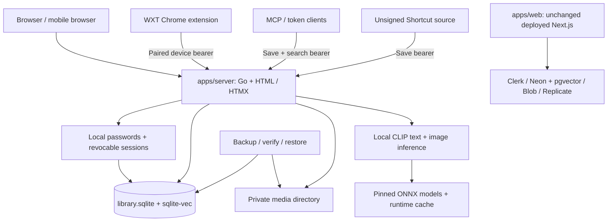

# Architecture

## Overview

Sploot has two separate web runtimes. `apps/server` is the self-contained local
product: Go HTTP, server-rendered HTML/HTMX, local accounts, SQLite/sqlite-vec,
private filesystem media, and CPU CLIP inference. `apps/web` remains the
deployed Next.js predecessor with its existing vendor services and data.

The Go product does not connect to or migrate the old real library. Existing
production, Clerk identities, Postgres/pgvector data, Blob media, and deployment
are unchanged. Local acceptance is not production cutover or migration proof.
Chrome capture uses TypeScript/WXT device pairing; MCP and the unsigned iPhone
Shortcut source use the published token-scoped save/search contract.

## Design Principles

- **One shared contract** for upload limits, MIME validation, and API shapes in
  `@sploot/common`; Go generates bounds instead of forking them.
- **One local library authority**: a persistent private directory owns accounts,
  SQLite state, original media, and the signing key. Shutdown never removes it.
- **One save boundary** owns validation, deduplication, instance storage admission,
  immutable originals/posters, idempotent receipts, and durable indexing intent.
- **Local computation, not a service dependency**: pinned text/image ONNX models
  run on the CPU. A separately reusable model cache contains no library data.
- **Explicit credential scopes**: browser security actions, paired-device library
  access, and personal-token save/search are distinct authorities.

## System Diagram

Each client targets one explicitly selected origin. There is no request-time
dual write, implicit identity mapping, or vendor fallback. See
[API ownership](./apps/web/docs/API.md) and
[runtime operations](./apps/web/docs/DEPLOYMENT.md) for the executable boundary.

## Components

### apps/server (self-contained Go + HTML/HTMX)
**Purpose**: Run a real persistent personal library without SaaS credentials.

**Responsibilities**:
- HTTP routes, accounts, credential scopes, and origin enforcement
  (`internal/httpapi`, `internal/auth`)
- Embedded templates, pinned HTMX, and focused browser JavaScript (`internal/web`)
- SQLite schema, foreign keys, WAL, and short serialized writer transactions
  (`internal/database`); no inference, decoding, or network I/O inside a writer
  transaction
- Original-byte ingestion, bounded FFmpeg posters, deduplication, disk admission, and
  owner-scoped receipts (`internal/ingest`)
- Browse/search, favorites, tags, sharing, trash/restore, browser-confirmed
  permanent deletion, settings, and owner ZIP export (`internal/library`, `internal/httpapi`)
- Durable indexing claims/retry and owner-filtered sqlite-vec retrieval
  (`internal/embedding`), using local text/image encoders (`internal/inference`)
- Structured logs and optional Sentry diagnostics (`internal/observability`);
  no telemetry credential is required to run
- Full local-library recovery (`internal/recovery`, `cmd/library-backup`),
  also exposed as `sploot backup/resume/verify/restore`

`cmd/sploot` opens and migrates SQLite, then serves the library while preparing
the verified inference bundle asynchronously. Saved media remains usable when
preparation fails; search readiness and errors expose that failure. Indexing starts
only after preparation succeeds. Shutdown joins preparation, HTTP requests and
indexing before closing native sessions and the database. The Dockerfile builds the
CGO binaries and includes FFmpeg/ffprobe; it requires persistent library and
model-cache volumes, not PostgreSQL clients or a Prisma migration job.

### apps/web (deployed Next.js predecessor)
**Purpose**: Retain the existing deployed product and its data/deployment authority.

Its Next.js routes/UI, Clerk, Prisma/Neon Postgres with pgvector, Vercel Blob,
Replicate, Sentry, billing/limiter state, and operational tooling remain separate.
Named Prisma migrations and the Node PRE_DEPLOY migration runner still belong
to that deployment; they do not initialize the Go SQLite library. Existing
predecessor CI gates remain intact.

The Go route surface intentionally differs: it uses a completed owner ZIP rather
than the predecessor's multipart export lifecycle, and does not register piles,
taste, advanced search, SSE, or consumer billing routes. Historical predecessor
ADRs and curated fixtures are not the local model or schema authority.

### apps/extension (WXT + React)
**Purpose**: Capture originals and screenshots into a selected Sploot instance.

**Responsibilities**:
- WXT service worker and popup, real Chrome capture actions, and retained
  immutable retries
- Device pairing approved through the instance's browser session; credentials
  are scoped to that exact origin and stable account owner
- Bearer-only API requests with cookies omitted, redirect rejection, and no
  Clerk SDK or authentication-bypass build
- Shared upload/MIME validation through `@sploot/common`

Local media URLs are private relative `/media/{id}` paths, not public Blob URLs.
A paired device must authenticate media fetches just as it authenticates library
requests. Browser approval/account-security authority is never delegated to the
extension. [Extension architecture](./apps/extension/ARCHITECTURE.md) owns queue
and credential lifecycles.

### packages/common
**Purpose**: Shared constants and API types.

**Responsibilities**:
- Upload constraints (`packages/common/src/constants.ts`)
- Shared API types (`packages/common/src/types.ts`)
- Go bounds and pinned HTMX assets are generated by
  `apps/server/scripts/generate-contract.ts`; `pnpm --filter server build` checks
  them against their inputs.
- Local inference identity comes from `internal/inference` and
  [`bundle.json`](./apps/server/internal/inference/bundle.json), not the retained
  predecessor's Replicate revision or economic/provider policy.

### MCP and iPhone Shortcut

`apps/mcp` exposes save/search over the same published API. Personal `splt_`
tokens permit those verbs only, not library listing, private media, export,
deletion, or account/token management. A matching result contains private media
references, not a public download grant. The
[Shortcut procedure](./apps/web/docs/shortcuts/save-to-sploot.md) distinguishes
instance-specific source from the predecessor's static packaging source.
Apple signing, physical iPhone acceptance, and Web Store publication are
separate from local web/Chromium proof.

## Data Flow

### Capture and retrieval
1. A browser, paired device, or personal-token client calls `POST /api/upload`
   (bytes) or `POST /api/upload/url` (direct media URL).
2. The save boundary validates the shared media contract and remote URL safety,
   deduplicates within the owner, and admits physical originals plus posters
   against an operator-configured instance limit and free-disk reserve. Trash
   still occupies storage; no per-account quota or fabricated allowance is exposed.
3. Immutable originals and posters live under private `media/`; SQLite records
   assets, tags, optional idempotent receipts, and durable indexing intent.
   Saving does not wait for inference. GIF/video originals remain playback and
   download sources; posters support previews and image embeddings.
4. The indexing worker claims pending work from SQLite and computes a normalized
   512-D image projection locally. Pending/processing/ready/failed states survive
   restart; failed work remains visible and owner-retryable.
5. `POST /api/search` caches owner/model-scoped query vectors, computes genuinely
   new text projections locally, and performs owner-filtered vector retrieval.
   Signed cursors bind the owner and search context.
   One in-process executor admits up to eight waiting interactive queries for
   at most 15 seconds. Queries precede pending indexing; after four queries a
   waiting indexer receives a turn. An active native call is never preempted.

### Data, cache, and account lifetime

The `pnpm dev` / `dev:local` launcher defaults to repository
`.sploot-local/library`. It does not seed accounts or fixtures. `library.sqlite`,
its WAL companions, `media/`, and `signing.key` belong to the operator and survive
ordinary shutdown. `--data-dir` selects another library; it is not a reset flag.

Model artifacts live in the OS cache under `sploot/models`, configurable with
`--model-dir`. The embedded manifest pins quantized CLIP ViT-B/32 text/vision
encoders, tokenizer/preprocessing, SHA-256 hashes, and native ONNX Runtime
artifacts for supported platforms. Missing files download on first preparation;
verification precedes loading, and a complete cache supports offline startup.
There are no seeded-vector or fake-inference fallbacks.
Library availability does not depend on model availability. Loading, ready,
unavailable and explicitly disabled inference are separate states; model failures
do not consume pending indexing work. Repair the cache or native dependency and
restart after an initialization failure.

Local accounts use Argon2id password hashes. Browser sessions last 30 days;
paired `spld_` device sessions last 90 days and grant owner-library operations.
Only the browser can change passwords, approve devices, or manage other
credentials. A password change retains the current browser session and revokes
the owner's other sessions, devices, personal tokens, and approved pending
pairings. No email delivery, verification, or password-reset service is claimed.

### Recovery and cutover

The operator recovery tool uses SQLite's online snapshot API, then copies and
hash-verifies the frozen database's referenced originals/posters. It never
copies a live SQLite/WAL file as an ad hoc backup. Resume reuses the frozen
snapshot; restore stages a complete library and atomically publishes only to an
explicit separate absent/empty target. Per-owner web ZIP export is not this
full-library recovery format.
Backups hold a shared library-directory lock through snapshot and media copying.
Permanent deletion commits an owner-fenced intent before unlinking bytes under
the exclusive lock; interrupted deletion resumes at startup. Completed tombstones
prevent an old upload receipt from resurrecting a purged asset. An interrupted
backup releases its lock: resume cannot recover uncopied originals purged since
that interruption. Keep deletion paused until that snapshot is complete.

Accounts/password hashes, IDs, metadata, vectors, tags, trash, public slugs,
and completed receipts survive recovery. Portable snapshots remove browser
and device sessions, pairing requests, personal upload tokens, authentication
attempts, and the signing key. Restored users sign in with their passwords,
mint new personal tokens, and pair devices again; this does not revoke
credentials on the untouched source.

[Deployment and recovery](./apps/web/docs/DEPLOYMENT.md#library-backup-and-isolated-restore)
owns commands, directory privacy, and exact parity-before-start requirements.
This format is for the local SQLite product, not an importer or backup of the
old Postgres/Blob library. A production migration/cutover needs its own
explicitly authorized data/identity/recovery design and acceptance.

## Key Decisions

- Root ADRs: `docs/adr/0001-*.md`, `docs/adr/0002-*.md`
- Web ADRs: `apps/web/docs/adr/00*-*.md` (embeddings, vector storage, caching, PWA)
- Predecessor-only database connection rules: `apps/web/docs/architecture/database-connection.md`

## Module Boundaries (Depth Check)

| Module | Interface | Hidden Complexity | Notes |
| --- | --- | --- | --- |
| Save boundary | bytes/URL to receipt; purge owned trash | capacity/reserve admission, immutable media, replay, durable deletion | `apps/server/internal/ingest` |
| Identity boundary | request to scoped owner | passwords, browser/device/PAT authority, origin checks, revocation | `apps/server/internal/auth` |
| Indexing/search | pending work or query to results | durable claims, local inference, owner filters, cursor binding | `apps/server/internal/embedding` + `inference` |
| Recovery | backup / resume / verify / restore | consistent SQLite copy, private bytes, credential scrubbing, atomic target | `apps/server/internal/recovery` |
| Shared contracts | generated bounds/types | one upload/MIME authority, separate pinned local model identity | `@sploot/common` + generator |

## Documentation Boundaries

The route inventory is hand-maintained and runtime-specific. Procedures live
beside their owning surface; current priorities and run conclusions live in
Linear/session records, not a second repository backlog. Local browser and
Chromium evidence does not establish current production migration, old-library
recovery, Apple signing/physical-device behavior, or store publication.
