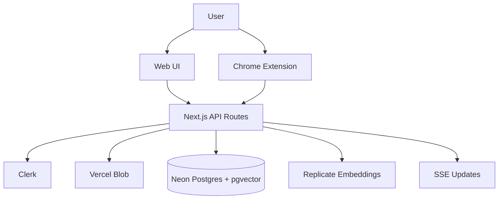

# Architecture

## Overview

Sploot is a monorepo with three deliverables: a Next.js web app, a Chrome
extension, and a shared package for cross-app types/constants. The web app
owns storage, search, and auth; the extension is a capture+upload client
that calls the web API; shared code keeps upload rules consistent.

## Design Principles

- **Single source of truth** for upload limits/types in `@sploot/common`.
- **Deep modules** in `apps/web/lib` hide complexity (upload pipeline, embeddings).
- **Strict env validation** to avoid silent prod failures (`DATABASE_URL`, `VITE_API_BASE_URL`).

## System Diagram

## Components

### apps/web (Next.js 15)
**Purpose**: User-facing app + API surface.

**Responsibilities**:
- Routes and UI (`apps/web/app`, `apps/web/components`)
- API handlers (`apps/web/app/api/**`)
- Upload pipeline + embedding orchestration (`apps/web/lib/upload`, `apps/web/lib/embeddings.ts`)
- Observability and metrics (`apps/web/lib/with-observability.ts`, `apps/web/lib/metrics-collector.ts`)
- Database access (`apps/web/lib/db.ts`, `apps/web/prisma`)

### apps/extension (WXT + React)
**Purpose**: Capture and upload images from any site.

**Responsibilities**:
- Background service worker (`apps/extension/entrypoints/background`)
- Popup UI (`apps/extension/entrypoints/popup`)
- API client + auth glue (`apps/extension/shared`)
- Uses `@sploot/common` for upload limits and MIME validation

### packages/common
**Purpose**: Shared constants and API types.

**Responsibilities**:
- Upload constraints (`packages/common/src/constants.ts`)
- Shared API types (`packages/common/src/types.ts`)

## Data Flow

### Web Upload (drag/drop or file picker)
1. Client calls `POST /api/upload` with multipart form data.
2. Server validates the file and writes the blob to Vercel Blob.
3. Server extracts metadata and stores the asset record in Postgres.
4. Embedding job runs async; results stored in `asset_embeddings`.
5. UI updates via SSE and polling.

### Extension Upload (right-click image)
1. Background script fetches image blob and validates size/MIME.
2. Extension calls `POST /api/upload` with Clerk auth token.
3. Server runs same pipeline as web upload.
4. Extension shows success/error notification.

## Key Decisions

- Root ADRs: `docs/adr/0001-*.md`, `docs/adr/0002-*.md`
- Web ADRs: `apps/web/docs/adr/00*-*.md` (embeddings, vector storage, caching, PWA)
- Database connection rules: `apps/web/docs/architecture/database-connection.md`

## Module Boundaries (Depth Check)

| Module | Interface | Hidden Complexity | Notes |
| --- | --- | --- | --- |
| Upload pipeline | small (service methods) | high | `apps/web/lib/upload/*` |
| Observability | small wrapper | medium | `apps/web/lib/with-observability.ts` |
| Shared constants | tiny | low | `@sploot/common` |

## Technical Debt / Known Gaps

- API docs are hand-maintained; keep `apps/web/docs/API.md` synced with routes.
- Extension docs and web docs use different voice; standardize later if desired.
