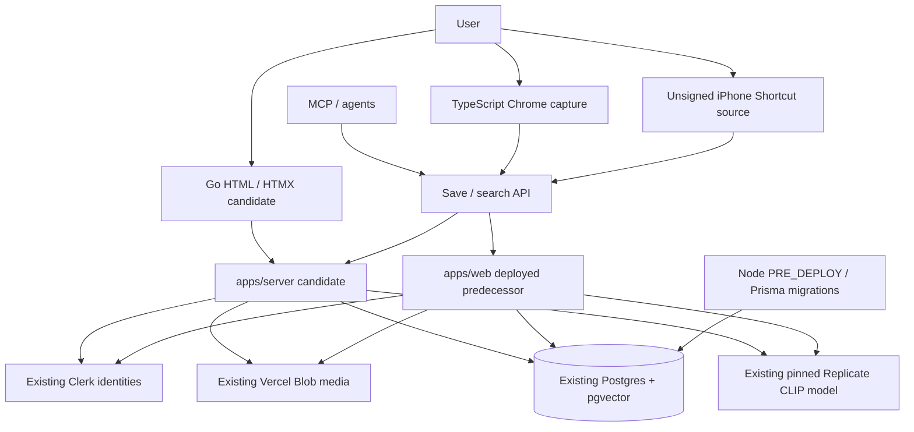

# Architecture

## Overview

Sploot retains two web runtimes during replacement. `apps/web` is the deployed
Next.js 16 predecessor. `apps/server` is the personal Go HTTP +
server-rendered HTML/HTMX candidate; it is not a production cutover. Chrome
capture remains TypeScript/WXT, and MCP and the iPhone Shortcut use the
published token-scoped save/search API.

The replacement changes the application runtime, not the library's ownership
or data authorities. Existing accounts, asset IDs, metadata, vectors, Blob
objects, tokens, and public share slugs remain compatibility obligations.
The predecessor stays runnable until real acceptance and rollback-safe cutover.

## Design Principles

- **Single source of truth** for upload limits/types in `@sploot/common`.
- **One application save boundary** owns validation, media, quota, metadata,
  idempotent receipts, and durable indexing intent.
- **Postgres owns durable state**: pgvector retrieval, processing claims,
  provider concurrency/windows, and daily/monthly attempt ceilings.
- **Explicit authority**: `DATABASE_URL` is the database authority; local QA and
  filesystem media are rejected in hosted environments.

## System Diagram

API clients target one selected origin; this is a transition diagram, not
request-time dual writes. Keep hosted routing on `/api/health/live`; use
`/api/health` for database/schema readiness, never platform liveness.

## Components

### apps/server (Go + HTML/HTMX candidate)
**Purpose**: Replace the personal web application and its capture/retrieval
boundary without replacing its storage or identity system.

**Responsibilities**:
- HTTP routes and authenticated API boundary (`internal/httpapi`, `internal/auth`)
- Embedded HTML templates, pinned HTMX, and focused browser JavaScript (`internal/web`)
- Original/thumbnail ingestion and owner-scoped receipts (`internal/ingest`)
- Library browsing, metadata, favorites, tags, sharing, token management, and
  owner ZIP export (`internal/library`, `internal/httpapi/export.go`)
- Replicate query embeddings and one in-process durable indexing worker
  (`internal/embedding`); retry rearms Postgres state, not another provider path
- Structured diagnostics and Sentry (`internal/observability`)
- Operator full-database/media backup and isolated restore
  (`cmd/library-backup`, `internal/recovery`)

`cmd/sploot` starts HTTP and the indexing worker together. Runtime SQL uses pgx;
the service does not run migrations on startup. The production Docker image
contains the Go binaries, FFmpeg/ffprobe, and PostgreSQL 15 recovery clients.

### apps/web (Next.js 16 predecessor and schema authority)
**Purpose**: Continue serving the deployed application and provide a rollback
artifact until candidate acceptance.

Retained responsibilities:
- Existing Next.js routes/UI, operational deployment tooling, and its own
  documented API behavior
- Named Prisma migrations and the separate Node PRE_DEPLOY migration runner
  (`apps/web/prisma`, `apps/web/scripts/migrate-deploy.mjs`)
- Curated QA media/vectors and the current pinned CLIP model revision used by
  Go contract generation

The candidate intentionally replaces the old multipart UI export lifecycle with
a session-authenticated ZIP download. It does not claim every legacy route,
consumer billing flow, or UI feature. See the runtime-specific inventory in
[`apps/web/docs/API.md`](./apps/web/docs/API.md).

### apps/extension (WXT + React)
**Purpose**: Capture and upload images from any site.

**Responsibilities**:
- Background service worker (`apps/extension/entrypoints/background`)
- Popup UI (`apps/extension/entrypoints/popup`)
- API client + auth glue (`apps/extension/shared`)
- Uses `@sploot/common` for upload limits and MIME validation

### packages/common
**Purpose**: Shared constants and API types.

**Responsibilities**:
- Upload constraints (`packages/common/src/constants.ts`)
- Shared API types (`packages/common/src/types.ts`)
- Go constants are generated by `apps/server/scripts/generate-contract.ts`
  from `@sploot/common`, `economics/policy.json`, and the retained
  `apps/web/lib/embeddings.ts` CLIP revision. `pnpm --filter server build`
  checks generated inputs; do not fork limits or change the model independently.

### MCP and iPhone Shortcut

`apps/mcp` exposes save/search over the same published API. Personal tokens
permit these verbs only, not library listing, export, deletion, or token
management. The [Shortcut source/release procedure](./apps/web/docs/shortcuts/save-to-sploot.md)
is not an installable integration until Apple signing and real iPhone
saved/duplicate/failure verification have completed.

## Data Flow

### Candidate capture and retrieval
1. Web, extension, or token client calls `POST /api/upload` (bytes) or
   `POST /api/upload/url` (direct media URL).
2. The save boundary validates media, deduplicates by owner/content hash, and
   admits physical storage quota before committing owned media and metadata.
   GIF/video originals remain playback sources; thumbnails/posters support previews.
3. The database stores the asset, durable indexing intent, and optional
   idempotency receipt. Saving does not wait for provider indexing.
4. The indexing worker claims pending work from Postgres and uses the existing
   model under shared rate/concurrency/circuit/attempt limits. The browser reads
   embedding status; a failed job remains visible and owner-retryable.
5. `POST /api/search` reuses cached query vectors or admits a new Replicate query
   embedding, then performs owner-scoped pgvector retrieval.

### Provider-free local loop

`pnpm dev:local` provisions an owned, disposable Postgres 15 database, applies
the retained migrations, seeds 24 curated assets, and serves local media from a
private launch directory. Signed QA auth is loopback-only. The cached
`reaction face meme` query exercises pgvector; new uploads are not indexed and
uncached queries fail closed. No live provider or production acceptance follows
from this loop. [README.md](./README.md#quick-start) owns the runnable commands.

### Recovery and cutover

`library-backup` captures a consistent full-database archive plus currently
stored source/thumbnail bytes, verifies hashes/catalog data, and restores only
to an explicit empty isolated target. It is separate from the per-owner web export.
Recovery keeps owner IDs, metadata, vectors, tokens, and share slugs; the isolated target
uses its own database role rather than restoring production roles/grants.
Recovery preserves stored media and all database metadata; it cannot reconstruct
original input bytes discarded by legacy optimization.

No current production/current-library backup or Go cutover is proved. The
[deployment and recovery procedure](./apps/web/docs/DEPLOYMENT.md) owns authority
files, client compatibility, restoration, the existing DigitalOcean service and
PRE_DEPLOY job, and application rollback.

## Key Decisions

- Root ADRs: `docs/adr/0001-*.md`, `docs/adr/0002-*.md`
- Web ADRs: `apps/web/docs/adr/00*-*.md` (embeddings, vector storage, caching, PWA)
- Database connection rules: `apps/web/docs/architecture/database-connection.md`

## Module Boundaries (Depth Check)

| Module | Interface | Hidden Complexity | Notes |
| --- | --- | --- | --- |
| Save boundary | bytes/URL to receipt | validation, quota, media, replay, durable intent | `apps/server/internal/ingest` |
| Identity boundary | request to existing owner | Clerk verification, identity mapping, PAT/QA limits | `apps/server/internal/auth` |
| Indexing/search | pending work or query to results | claims, budgets, provider circuit, cursor binding | `apps/server/internal/embedding` |
| Recovery | backup / verify / restore | snapshot consistency, private media, database/byte parity | `apps/server/internal/recovery` |
| Shared contracts | generated constants/types | one upload/MIME/model/policy authority | `@sploot/common` + generator |

## Documentation Boundaries

The route inventory is hand-maintained and runtime-specific. Deployment receipts,
current library recovery evidence, Chrome release receipts, and Apple/device
acceptance remain separate authorities; repository code or a local smoke pass
does not establish any of them.
