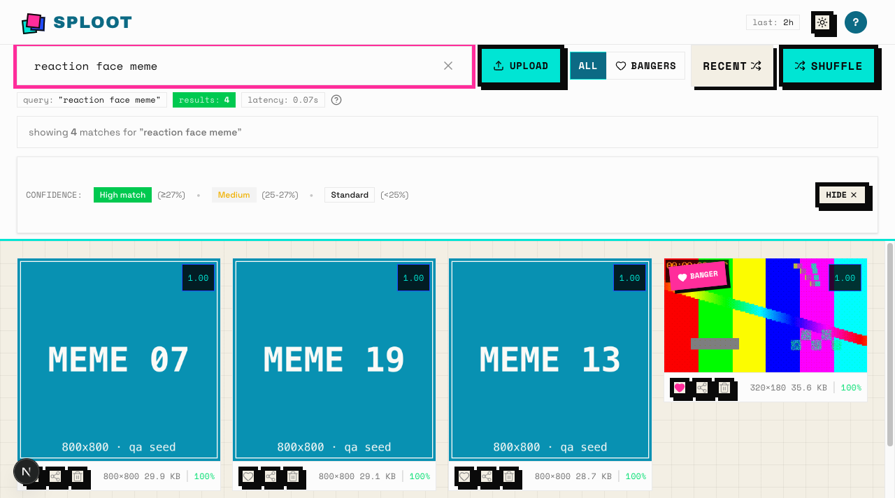

# Sploot 🏷️

> **A private library for your memes and screenshots.** Save from anywhere in
> one click, then find any of them by typing what's in the picture.

**[sploot.app](https://www.sploot.app)**

Type words. Get the picture — a stranger goes from the landing page to a real
semantic search in about half a minute (opt-in starter pile with precomputed
CLIP vectors; see `docs/design/lab-053-stranger-aha.html`):


This monorepo consolidates the Sploot web application, browser extension, and shared packages.

Sploot is a personal meme library with text→image semantic search: save a
meme once (right-click, share sheet, or iOS shortcut) and later find it by
describing what's in it — no tags, no folders, no remembering filenames.



*Historical, seeded-local search walkthrough from 2026-07-07, not current hosted
verification. This selected screenshot remains a public documentation asset;
its retained [source packet](./docs/qa/evidence/2026-07-07-sploot-051-readme-frontdoor/)
records the original exercise.*

## ✨ What it does today

- **Save from anywhere**: right-click → "Save to Sploot" (Chrome extension),
  iOS share sheet / shortcut, or drag-and-drop upload on the web app.
- **Find by description**: type what's in the image — text→image semantic
  search (pgvector + CLIP embeddings), not keyword/tag matching.
- **Bangers and piles**: favorite the ones you'll reuse; automatic piles
  group your library by rough theme.

Sploot does not yet learn *your* taste or generate new memes.
[VISION.md](./VISION.md) records optional product intent and economic constraints,
not a delivery roadmap or evidence that those ambitions shipped.

## 🧩 Browser extension

Chrome extension (WXT) for one-click "Save to Sploot" from a right-click
context menu. The candidate in `apps/extension/dist/` is **not submitted or
published** in the Chrome Web Store; no live listing URL or receipt is claimed.
Source: [`apps/extension`](./apps/extension).

## 🛠️ For developers

This is a Turborepo/pnpm monorepo: web app, browser extension, and shared
packages.

| Workspace | Path | Description |
|-----------|------|-------------|
| **Web App** | [`apps/web`](./apps/web) | Next.js 16 App Router on DigitalOcean, Vercel Blob, pgvector, Clerk Auth. |
| **Extension** | [`apps/extension`](./apps/extension) | Chrome Extension (WXT) for one-click saving. |
| **MCP Server** | [`apps/mcp`](./apps/mcp) | `sploot-mcp` — save + search as agent tools over the [published API](./apps/web/docs/PUBLIC_API.md). |
| **Common** | [`packages/common`](./packages/common) | Shared constants, types, and utilities. |

## 🤖 Agent access

Agents (and the operator's agent fleet) save and search Sploot without a
browser: the **sploot MCP server** (`apps/mcp`) exposes `sploot_search` and
`sploot_save` as tools over a personal API token, and the
**`misty-sploot`** skill teaches the verbs. See
[`apps/web/docs/PUBLIC_API.md`](./apps/web/docs/PUBLIC_API.md) for the
published contract and [`docs/five-faces.md`](./docs/five-faces.md) for
Sploot's face-by-face status (UI/API/MCP/skill shipped; CLI explicitly
waived, rationale in that doc).


### Quick Start

#### Prerequisites
- Node.js 20+
- pnpm 10+ (`npm i -g pnpm`)

#### Installation

```bash
pnpm install
```

#### Local loop, no vendor credentials (recommended first run)

One command from clone to a signed-in, seeded, searchable library — no
Clerk/Neon/Blob/Replicate keys. Requires Docker for the local pgvector
Postgres:

```bash
pnpm dev:local
```

It provisions the database, applies migrations, seeds 24 browsable assets,
boots the web app with qa-local auth (see `apps/web/docs/AUTH.md`), and runs a
doctor pass that writes an evidence packet (health, signed-in `/app`, seeded
grid, search response) to `.sploot-local/doctor/`. When it finishes, open
`http://localhost:3001/api/qa-auth/login` to land signed-in on `/app`.

Teardown removes the database container and `.sploot-local/`, including default
QA packets. Retain needed output first (see [QA ownership](./docs/qa/README.md)):

```bash
pnpm dev:local:down
```

#### Development against real services

Run all apps simultaneously (Web: localhost:3001, Extension: hot-reload) —
requires `apps/web/.env.local` with real vendor credentials
(`apps/web/.env.example`):

```bash
pnpm dev
```

Or run specific apps:

```bash
pnpm dev:web
pnpm dev:extension
```

### Commands

We use **Turborepo** to orchestrate tasks.

- **Build**: `pnpm build` (Builds all apps/packages)
- **Lint**: `pnpm lint`
- **Type Check**: `pnpm type-check`
- **Test**: `pnpm test`
- **Clean**: `pnpm clean`

### Architecture

- **Monorepo Tooling**: Turborepo + pnpm workspaces.
- **Shared Code**: `@sploot/common` is consumed by both `web` and `extension`.
- **CI/CD**: GitHub Actions (Lint, Test, Type-check).
- **Deployment**: 
  - Web: Automatic via DigitalOcean App Platform.
  - Extension: Manual submission to Chrome Web Store.
- **Details**: See [ARCHITECTURE.md](./ARCHITECTURE.md).

### Configuration

Each app has its own env setup:
- Web app: see [`apps/web/README.md`](./apps/web/README.md)
- Extension: see [`apps/extension/README.md`](./apps/extension/README.md)

### Documentation

The repository owns version-bound product/system knowledge, accepted decisions,
portable procedures, curated fixtures, and shipped assets. Linear owns current
work and prioritization; current requests authorize changes. Raw or sensitive
run output belongs in approved retained artifact storage, with a sanitized
revision/scope/verdict link in the work item. Runtime and release ledgers retain
their native authority; historical files are not an automatic intake queue.

- [QA procedure and evidence ownership](./docs/qa/README.md)
- [Design contract](./DESIGN.md)

- [Contributor instructions](./AGENTS.md) - Repository guidance for agents and developers.
- [Web App Docs](./apps/web/README.md)
- [Extension Docs](./apps/extension/README.md)
- [Architecture](./ARCHITECTURE.md)
- [ADRs](./docs/adr)
