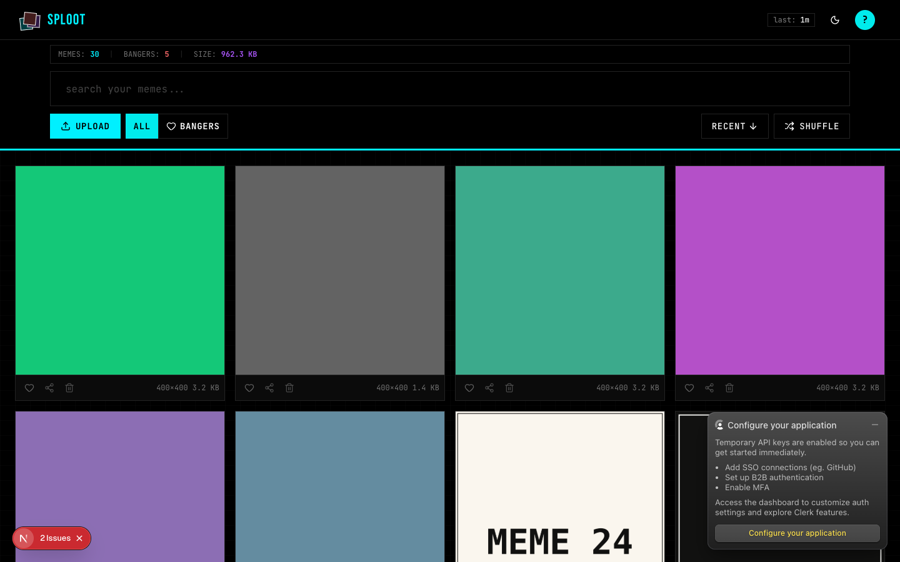
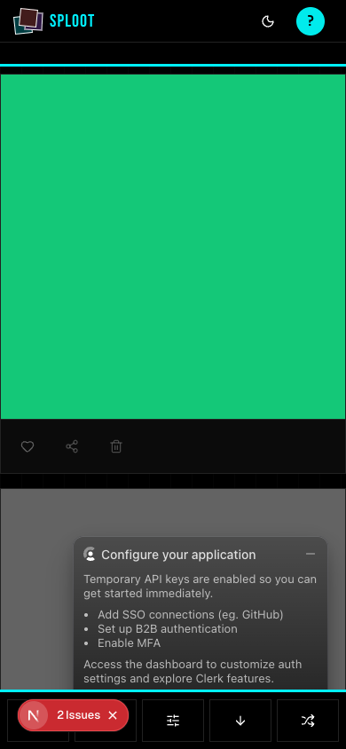

# Evidence Packet: bulk-import

- Date: 2026-06-10
- Branch: `feat/bulk-import`
- Commit: `9766f93`

## Intent

Dropping a zip of images or a bookmarks-export JSON/CSV onto the upload zone bulk-imports: zip entries ride the normal upload pipeline with dedupe, text bundles have their image URLs imported through /api/upload/url.

## Checks

### PASS — tests: __tests__/lib/upload/bulk-import.test.ts (1.1s)

```
CI=1 pnpm --filter web vitest run __tests__/lib/upload/bulk-import.test.ts
```

Transcript: [transcripts/tests-0.txt](transcripts/tests-0.txt)

## Browser Evidence

### /app @ 1440x900



Console errors:
- [error] A tree hydrated but some attributes of the server rendered HTML didn't match the client properties. This won't be patched up. This can happen if a SSR-ed Client Component used:
- [error] A tree hydrated but some attributes of the server rendered HTML didn't match the client properties. This won't be patched up. This can happen if a SSR-ed Client Component used:

### /app @ 390x844



Console errors:
- [error] A tree hydrated but some attributes of the server rendered HTML didn't match the client properties. This won't be patched up. This can happen if a SSR-ed Client Component used:
- [error] A tree hydrated but some attributes of the server rendered HTML didn't match the client properties. This won't be patched up. This can happen if a SSR-ed Client Component used:

## Verdict: PASS

⚠ 4 console error(s) captured — review the browser evidence before trusting this verdict.

## Residual Risk

- Live UI run: 7-image zip (one byte-identical duplicate + a notes.txt) ingested as exactly 6 assets; bookmarks JSON with 2 fixture URLs + 1 junk URL produced 2 dedupe hits (409) and filtered the junk client-side. Grid shows MEMES: 30.
- Folder drag-drop (webkitGetAsEntry traversal) not implemented; zip and text exports cover the bulk path for v1.
- Hydration mismatch console errors are pre-existing on master.
