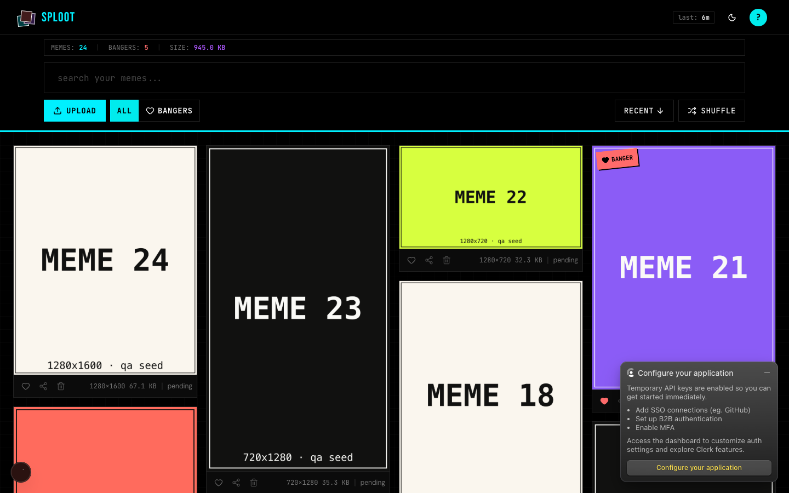
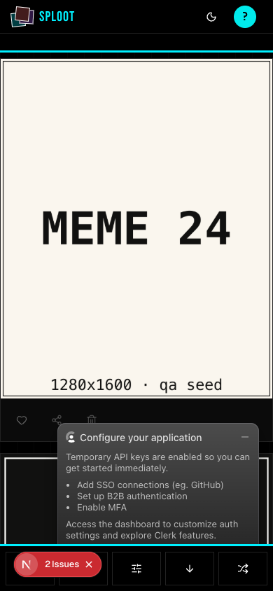

# Evidence Packet: harness-smoke

- Date: 2026-06-10
- Branch: `feat/qa-evidence-packets`
- Commit: `88bfea3`

## Intent

The qa:evidence harness works end to end: seeded fixtures render authenticated at /app, walks capture loaded images and console state, packet verdict reflects reality.

## Checks

### PASS — qa seed (1.7s)

```
pnpm --filter web qa:seed
```

Transcript: [transcripts/qa-seed.txt](transcripts/qa-seed.txt)

### PASS — tests: __tests__/lib/qa/evidence-packet.test.ts (1.1s)

```
CI=1 pnpm --filter web vitest run __tests__/lib/qa/evidence-packet.test.ts
```

Transcript: [transcripts/tests-0.txt](transcripts/tests-0.txt)

## Browser Evidence

### /app @ 1440x900



Console errors:
- [error] A tree hydrated but some attributes of the server rendered HTML didn't match the client properties. This won't be patched up. This can happen if a SSR-ed Client Component used:
- [error] A tree hydrated but some attributes of the server rendered HTML didn't match the client properties. This won't be patched up. This can happen if a SSR-ed Client Component used:

### /app @ 390x844



Console errors:
- [error] A tree hydrated but some attributes of the server rendered HTML didn't match the client properties. This won't be patched up. This can happen if a SSR-ed Client Component used:
- [error] A tree hydrated but some attributes of the server rendered HTML didn't match the client properties. This won't be patched up. This can happen if a SSR-ed Client Component used:

## Verdict: PASS

⚠ 4 console error(s) captured — review the browser evidence before trusting this verdict.

## Residual Risk

- Hydration mismatch console errors are pre-existing on master; tracked separately.
- Clerk dev-instance popup may overlay screenshots under test keys.
