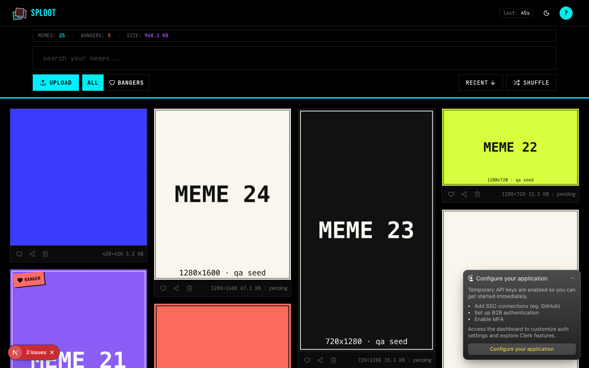
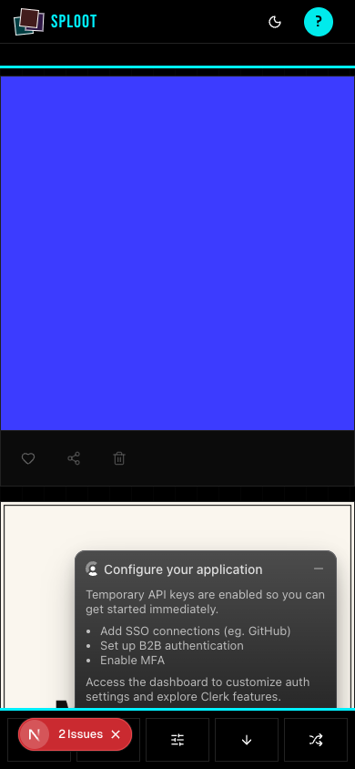

# Evidence Packet: persistent-upload-queue

- Date: 2026-06-10
- Branch: `feat/persistent-upload-queue`
- Commit: `7ce83fe`

## Intent

An upload attempted offline survives a page refresh: it persists to IndexedDB, recovery fires exactly once on next upload-panel mount despite render churn, the resumed upload completes, and the queue record is dequeued.

## Checks

### PASS — tests: __tests__/lib/upload-queue-recovery.test.tsx (1.2s)

```
CI=1 pnpm --filter web vitest run __tests__/lib/upload-queue-recovery.test.tsx
```

Transcript: [transcripts/tests-0.txt](transcripts/tests-0.txt)

### PASS — tests: __tests__/api/upload-quota-gates.test.ts (0.9s)

```
CI=1 pnpm --filter web vitest run __tests__/api/upload-quota-gates.test.ts
```

Transcript: [transcripts/tests-1.txt](transcripts/tests-1.txt)

## Browser Evidence

### /app @ 1440x900



Console errors:
- [error] A tree hydrated but some attributes of the server rendered HTML didn't match the client properties. This won't be patched up. This can happen if a SSR-ed Client Component used:
- [error] A tree hydrated but some attributes of the server rendered HTML didn't match the client properties. This won't be patched up. This can happen if a SSR-ed Client Component used:

### /app @ 390x844



Console errors:
- [error] A tree hydrated but some attributes of the server rendered HTML didn't match the client properties. This won't be patched up. This can happen if a SSR-ed Client Component used:
- [error] A tree hydrated but some attributes of the server rendered HTML didn't match the client properties. This won't be patched up. This can happen if a SSR-ed Client Component used:

## Verdict: PASS

⚠ 4 console error(s) captured — review the browser evidence before trusting this verdict.

## Residual Risk

- Live walk shows the recovered offline upload (blue 420x420, MEMES: 25) and queue records: 0 after recovery. Recovery requires the upload panel to mount; recovery on bare /app load (without opening the panel) is follow-up scope.
- Hydration mismatch console errors are pre-existing on master.
