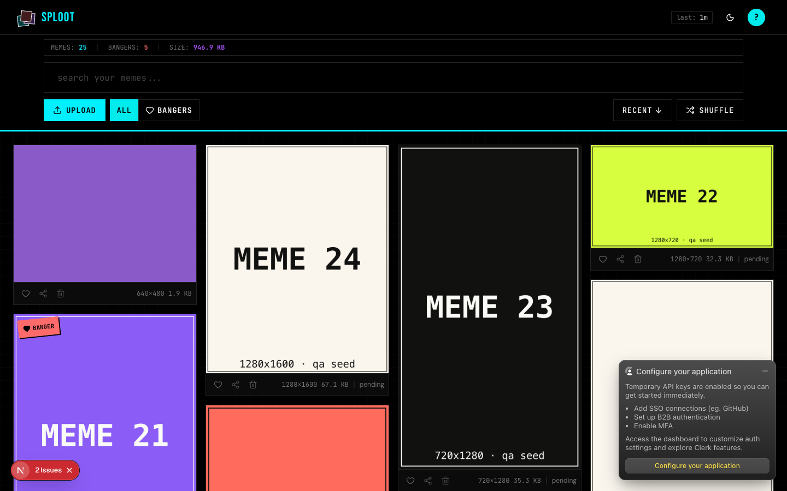
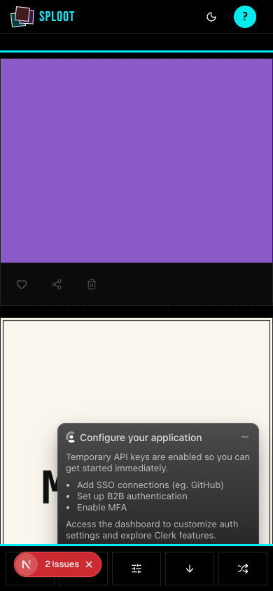

# Evidence Packet: share-target

- Date: 2026-06-10
- Branch: `feat/pwa-share-target`
- Commit: `7528552`

## Intent

PWA share-target: an OS share-sheet POST to /share-target authenticates, ingests through the shared pipeline (real blob upload + dedupe), and redirects into the library where the shared meme is visible.

## Checks

### PASS — tests: __tests__/app/share-target.test.ts (1.3s)

```
CI=1 pnpm --filter web vitest run __tests__/app/share-target.test.ts
```

Transcript: [transcripts/tests-0.txt](transcripts/tests-0.txt)

### PASS — tests: __tests__/api/upload-quota-gates.test.ts (1.1s)

```
CI=1 pnpm --filter web vitest run __tests__/api/upload-quota-gates.test.ts
```

Transcript: [transcripts/tests-1.txt](transcripts/tests-1.txt)

## Browser Evidence

### /app @ 1440x900



Console errors:
- [error] A tree hydrated but some attributes of the server rendered HTML didn't match the client properties. This won't be patched up. This can happen if a SSR-ed Client Component used:
- [error] A tree hydrated but some attributes of the server rendered HTML didn't match the client properties. This won't be patched up. This can happen if a SSR-ed Client Component used:

### /app @ 390x844



Console errors:
- [error] A tree hydrated but some attributes of the server rendered HTML didn't match the client properties. This won't be patched up. This can happen if a SSR-ed Client Component used:
- [error] A tree hydrated but some attributes of the server rendered HTML didn't match the client properties. This won't be patched up. This can happen if a SSR-ed Client Component used:

## Verdict: PASS

⚠ 4 console error(s) captured — review the browser evidence before trusting this verdict.

## Residual Risk

- Real-device share sheet (Android/iOS) not exercised; flow proven via simulated multipart navigation POSTs (curl): 303 -> /app?shared=1, repeat 303 -> /app?duplicates=1, unauthed 303 -> /sign-in.
- Hydration mismatch console errors are pre-existing on master.
