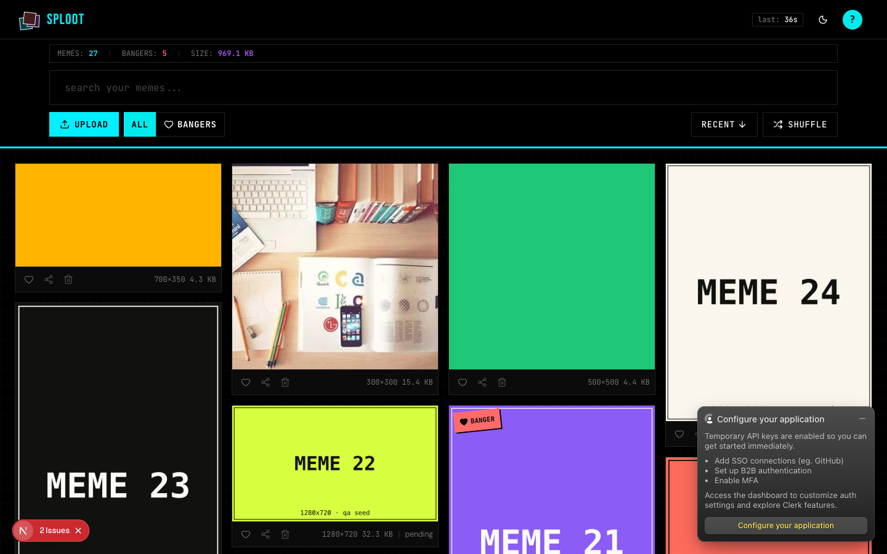
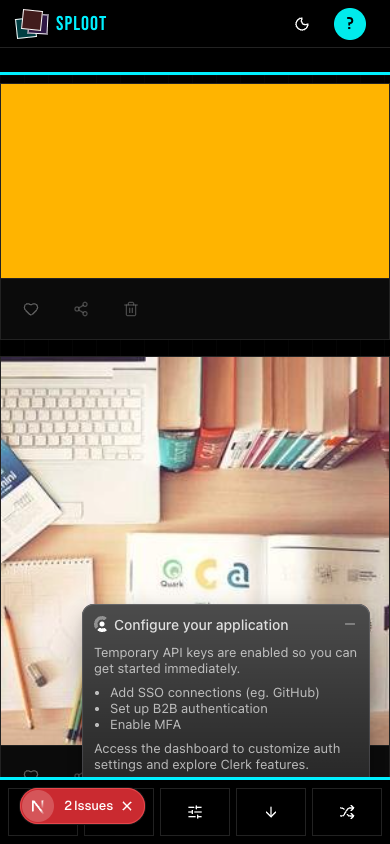

# Evidence Packet: url-import

- Date: 2026-06-10
- Branch: `feat/url-import`
- Commit: `8cb2037`

## Intent

Pasting an image URL into the upload zone imports the remote image server-side through the shared ingest pipeline; private/internal hosts are rejected at validation.

## Checks

### PASS — tests: __tests__/lib/upload/url-import.test.ts (1.1s)

```
CI=1 pnpm --filter web vitest run __tests__/lib/upload/url-import.test.ts
```

Transcript: [transcripts/tests-0.txt](transcripts/tests-0.txt)

### PASS — tests: __tests__/api/upload-url.test.ts (1.0s)

```
CI=1 pnpm --filter web vitest run __tests__/api/upload-url.test.ts
```

Transcript: [transcripts/tests-1.txt](transcripts/tests-1.txt)

## Browser Evidence

### /app @ 1440x900



Console errors:
- [error] A tree hydrated but some attributes of the server rendered HTML didn't match the client properties. This won't be patched up. This can happen if a SSR-ed Client Component used:
- [error] A tree hydrated but some attributes of the server rendered HTML didn't match the client properties. This won't be patched up. This can happen if a SSR-ed Client Component used:

### /app @ 390x844



Console errors:
- [error] A tree hydrated but some attributes of the server rendered HTML didn't match the client properties. This won't be patched up. This can happen if a SSR-ed Client Component used:
- [error] A tree hydrated but some attributes of the server rendered HTML didn't match the client properties. This won't be patched up. This can happen if a SSR-ed Client Component used:

## Verdict: PASS

⚠ 4 console error(s) captured — review the browser evidence before trusting this verdict.

## Residual Risk

- Live walk shows 3 URL-imported assets (incl. real external picsum.photos jpeg via 302 redirect). Live API calls: 201 created, 409 dedupe, 400 SSRF reject (169.254.169.254 with QA hatch active), 401 unauthed, 422 unreachable host.
- DNS-rebinding SSRF is out of scope (single-user app); hostname checks + post-redirect re-check only.
- Hydration mismatch console errors are pre-existing on master.
