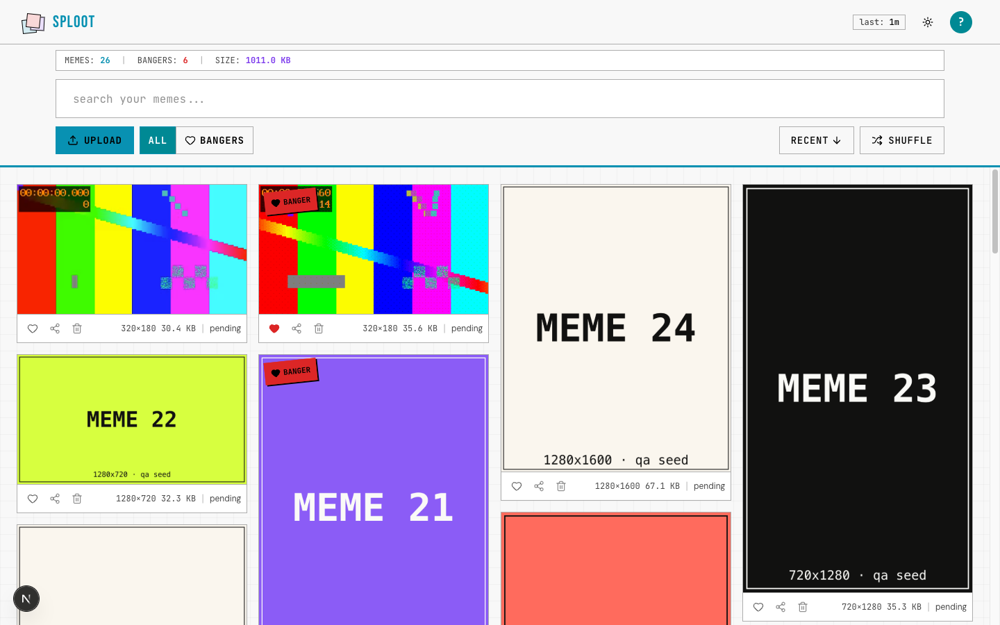
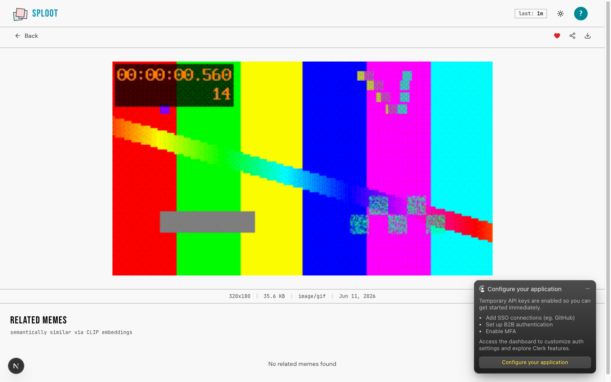
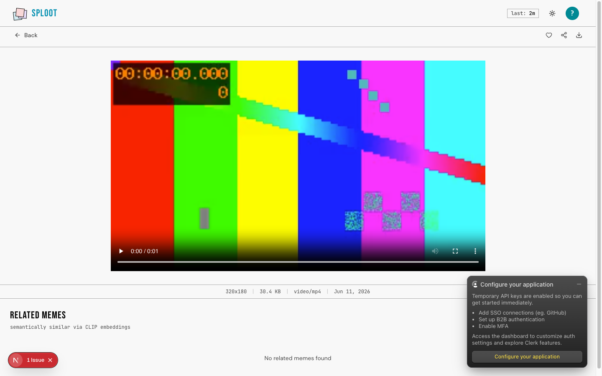
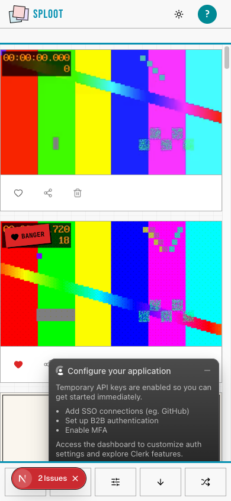
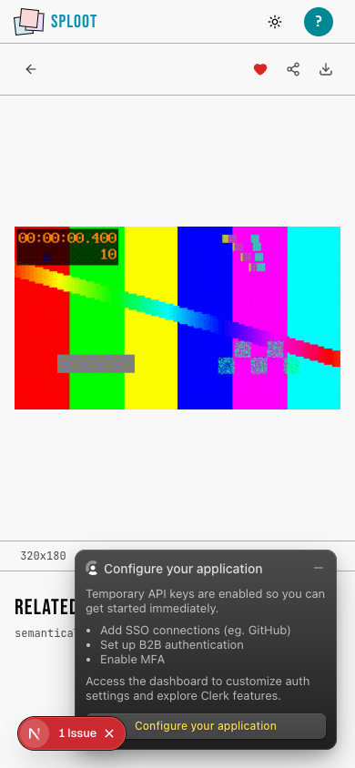
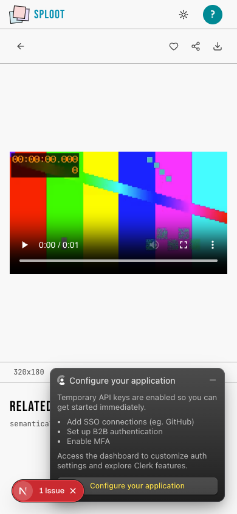

# Evidence Packet: animated-media

- Date: 2026-06-11
- Branch: `deliver-028-animated-memes`
- Commit: `855c697`

## Intent

animated GIF and short video memes render in library grid and detail views

## Checks

### PASS — qa seed (3.5s)

```
pnpm --filter web qa:seed
```

Transcript: [transcripts/qa-seed.txt](transcripts/qa-seed.txt)

### PASS — tests: __tests__/components/library/animated-media-tile.test.tsx (2.9s)

```
CI=1 pnpm --filter web vitest run __tests__/components/library/animated-media-tile.test.tsx
```

Transcript: [transcripts/tests-0.txt](transcripts/tests-0.txt)

### PASS — tests: __tests__/lib/upload/image-processor-service.test.ts (3.4s)

```
CI=1 pnpm --filter web vitest run __tests__/lib/upload/image-processor-service.test.ts
```

Transcript: [transcripts/tests-1.txt](transcripts/tests-1.txt)

### PASS — tests: __tests__/lib/upload/blob-uploader-service.test.ts (3.3s)

```
CI=1 pnpm --filter web vitest run __tests__/lib/upload/blob-uploader-service.test.ts
```

Transcript: [transcripts/tests-2.txt](transcripts/tests-2.txt)

### PASS — tests: __tests__/lib/upload/url-import.test.ts (1.9s)

```
CI=1 pnpm --filter web vitest run __tests__/lib/upload/url-import.test.ts
```

Transcript: [transcripts/tests-3.txt](transcripts/tests-3.txt)

## Browser Evidence

### /app @ 1440x900



Console errors:
- [error] A tree hydrated but some attributes of the server rendered HTML didn't match the client properties. This won't be patched up. This can happen if a SSR-ed Client Component used:
- [error] A tree hydrated but some attributes of the server rendered HTML didn't match the client properties. This won't be patched up. This can happen if a SSR-ed Client Component used:

### /app/meme/cmqa138md00015qeg1zm3042b @ 1440x900



Console errors:
- [error] A tree hydrated but some attributes of the server rendered HTML didn't match the client properties. This won't be patched up. This can happen if a SSR-ed Client Component used:

### /app/meme/cmqa138sb00035qeg19rne13r @ 1440x900



Console errors:
- [error] A tree hydrated but some attributes of the server rendered HTML didn't match the client properties. This won't be patched up. This can happen if a SSR-ed Client Component used:

### /app @ 390x844



Console errors:
- [error] A tree hydrated but some attributes of the server rendered HTML didn't match the client properties. This won't be patched up. This can happen if a SSR-ed Client Component used:
- [error] A tree hydrated but some attributes of the server rendered HTML didn't match the client properties. This won't be patched up. This can happen if a SSR-ed Client Component used:

### /app/meme/cmqa138md00015qeg1zm3042b @ 390x844



Console errors:
- [error] A tree hydrated but some attributes of the server rendered HTML didn't match the client properties. This won't be patched up. This can happen if a SSR-ed Client Component used:

### /app/meme/cmqa138sb00035qeg19rne13r @ 390x844



Console errors:
- [error] A tree hydrated but some attributes of the server rendered HTML didn't match the client properties. This won't be patched up. This can happen if a SSR-ed Client Component used:

## Verdict: PASS

⚠ 8 console error(s) captured — review the browser evidence before trusting this verdict.

## Residual Risk

- DB-backed upload path verified against local pgvector seed; real Vercel Blob write remains covered by existing upload integration and requires production Blob credentials.
