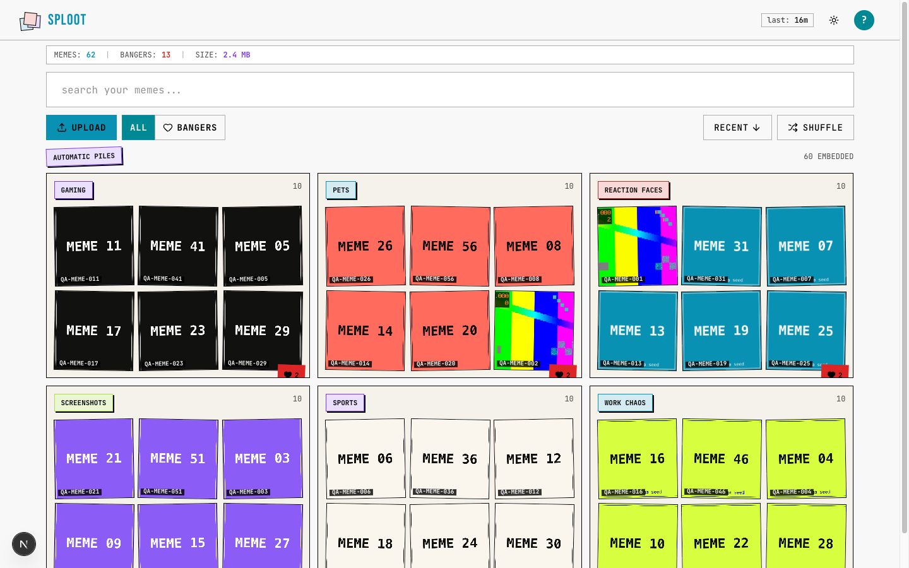

# Evidence Packet: automatic-piles

- Date: 2026-06-11
- Branch: `deliver-025-semantic-piles`
- Commit: `7603ce2`

## Intent

automatic semantic piles render from existing pgvector embeddings without a typed query

## Checks

### PASS — qa seed (7.7s)

```
pnpm --filter web exec tsx scripts/qa-seed.ts --count 60
```

Transcript: [transcripts/qa-seed.txt](transcripts/qa-seed.txt)

### PASS — type-check (7.6s)

```
pnpm --filter web type-check
```

Transcript: [transcripts/type-check.txt](transcripts/type-check.txt)

### PASS — lint (3.8s)

```
pnpm --filter web lint
```

Transcript: [transcripts/lint.txt](transcripts/lint.txt)

### PASS — tests: __tests__/lib/piles/semantic-piles.test.ts (2.1s)

```
CI=1 pnpm --filter web vitest run __tests__/lib/piles/semantic-piles.test.ts
```

Transcript: [transcripts/tests-0.txt](transcripts/tests-0.txt)

### PASS — tests: __tests__/api/piles.test.ts (2.0s)

```
CI=1 pnpm --filter web vitest run __tests__/api/piles.test.ts
```

Transcript: [transcripts/tests-1.txt](transcripts/tests-1.txt)

### PASS — tests: __tests__/components/sploot/atlas-landing-hero.test.tsx (1.9s)

```
CI=1 pnpm --filter web vitest run __tests__/components/sploot/atlas-landing-hero.test.tsx
```

Transcript: [transcripts/tests-2.txt](transcripts/tests-2.txt)

### PASS — api piles probe (2.7s)

```
GET /api/piles?limit=6&minAssets=50
```

Transcript: [transcripts/piles-probe.txt](transcripts/piles-probe.txt)

## Browser Evidence

### /app @ 1440x900



Console errors:
- [error] A tree hydrated but some attributes of the server rendered HTML didn't match the client properties. This won't be patched up. This can happen if a SSR-ed Client Component used:
- [error] A tree hydrated but some attributes of the server rendered HTML didn't match the client properties. This won't be patched up. This can happen if a SSR-ed Client Component used:

### /app @ 390x844


Console errors:
- [error] A tree hydrated but some attributes of the server rendered HTML didn't match the client properties. This won't be patched up. This can happen if a SSR-ed Client Component used:
- [error] A tree hydrated but some attributes of the server rendered HTML didn't match the client properties. This won't be patched up. This can happen if a SSR-ed Client Component used:

## Verdict: PASS

⚠ 4 console error(s) captured — review the browser evidence before trusting this verdict.

## Residual Risk

- Real user clustering quality depends on existing CLIP embedding quality and curated text anchors; persistence/backfill tables are deferred until load profiling proves they are needed.
