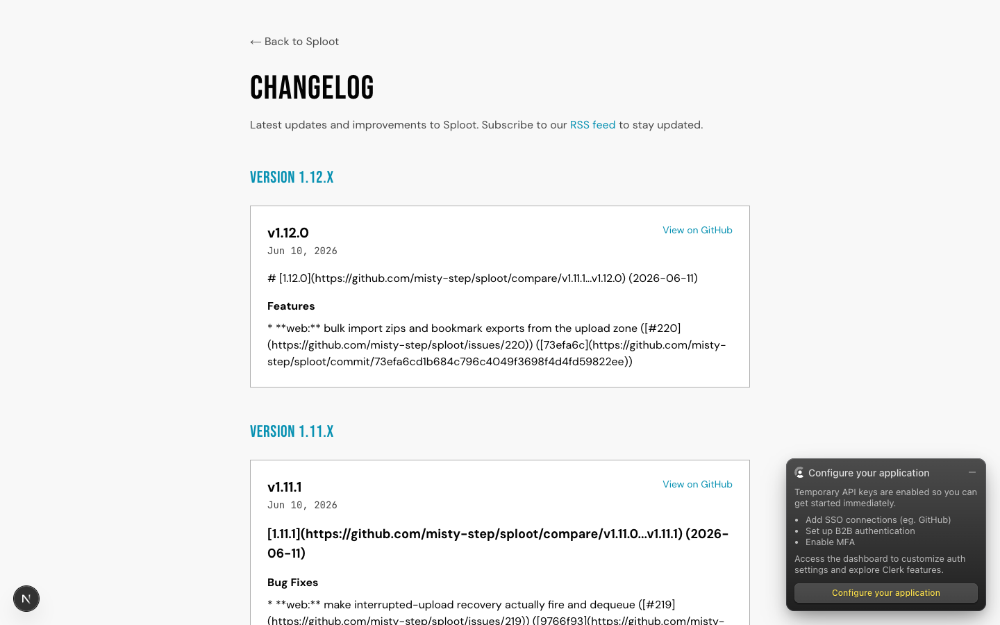
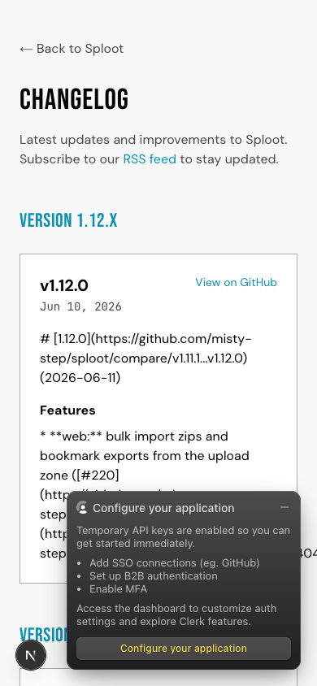

# Evidence Packet: changelog-version

- Date: 2026-06-11
- Branch: `fix/changelog-and-version`
- Commit: `73efa6c`

## Intent

The changelog and version surfaces show real landfall releases: /changelog renders v1.x history from the correct repo, /changelog.xml emits 20 items, /api/version returns the latest tag, settings shows it.

## Checks

### PASS — tests: __tests__/lib/releases.test.ts (1.4s)

```
CI=1 pnpm --filter web vitest run __tests__/lib/releases.test.ts
```

Transcript: [transcripts/tests-0.txt](transcripts/tests-0.txt)

## Browser Evidence

### /changelog @ 1440x900



No page or console errors.

### /changelog @ 390x844



No page or console errors.

## Verdict: PASS

## Residual Risk

- Settings version line verified by code + /api/version curl (v1.12.0); authenticated settings walk not in this packet.
- Release-note markdown renders as raw link syntax — cosmetic, deferred to the design-system pass.
