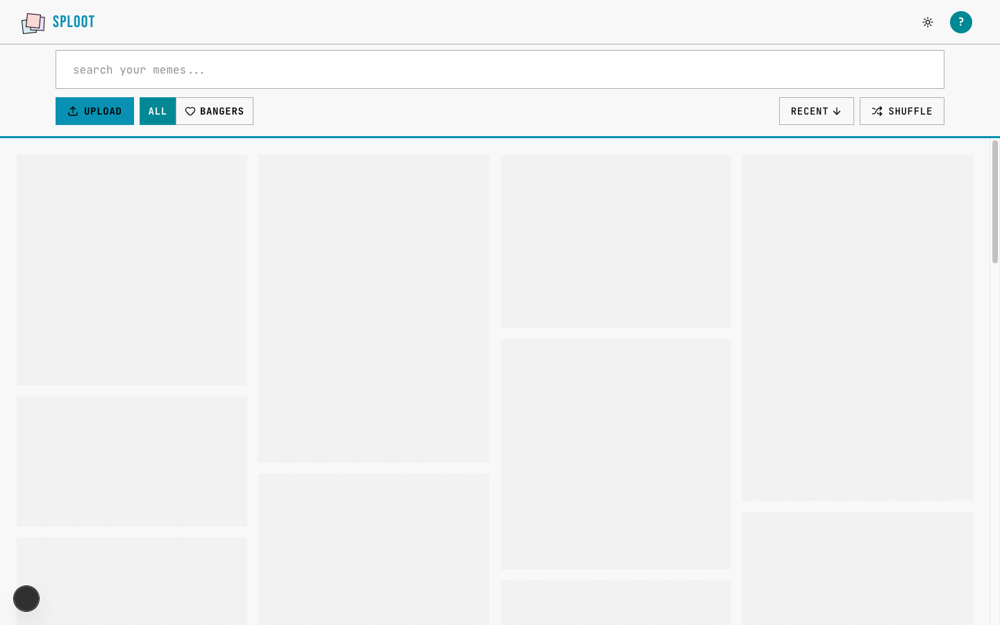
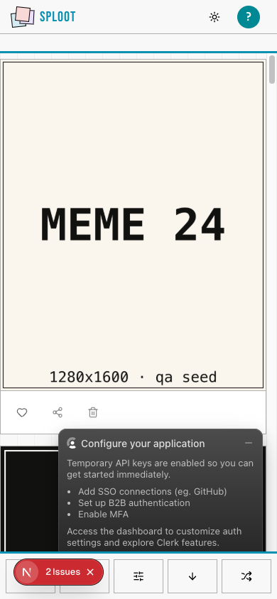

# Evidence Packet: dead-web-infra

- Date: 2026-06-11
- Branch: `deliver-027-dead-web-infra`
- Commit: `5f55b6c`

## Intent

dead web-only infrastructure is deleted while /app still renders the upload/library surface

## Checks

### PASS — qa seed (2.5s)

```
pnpm --filter web qa:seed
```

Transcript: [transcripts/qa-seed.txt](transcripts/qa-seed.txt)

### PASS — tests: __tests__/components/upload/upload-drop-zone.test.tsx (2.2s)

```
CI=1 pnpm --filter web vitest run __tests__/components/upload/upload-drop-zone.test.tsx
```

Transcript: [transcripts/tests-0.txt](transcripts/tests-0.txt)

## Browser Evidence

### /app @ 1440x900



Console errors:
- [error] A tree hydrated but some attributes of the server rendered HTML didn't match the client properties. This won't be patched up. This can happen if a SSR-ed Client Component used:
- [error] A tree hydrated but some attributes of the server rendered HTML didn't match the client properties. This won't be patched up. This can happen if a SSR-ed Client Component used:

### /app @ 390x844



Console errors:
- [error] A tree hydrated but some attributes of the server rendered HTML didn't match the client properties. This won't be patched up. This can happen if a SSR-ed Client Component used:
- [error] A tree hydrated but some attributes of the server rendered HTML didn't match the client properties. This won't be patched up. This can happen if a SSR-ed Client Component used:

## Verdict: PASS

⚠ 4 console error(s) captured — review the browser evidence before trusting this verdict.

## Residual Risk

- smoke renders the upload/library surface but does not execute a blob upload; upload behavior remains covered by the existing upload tests
