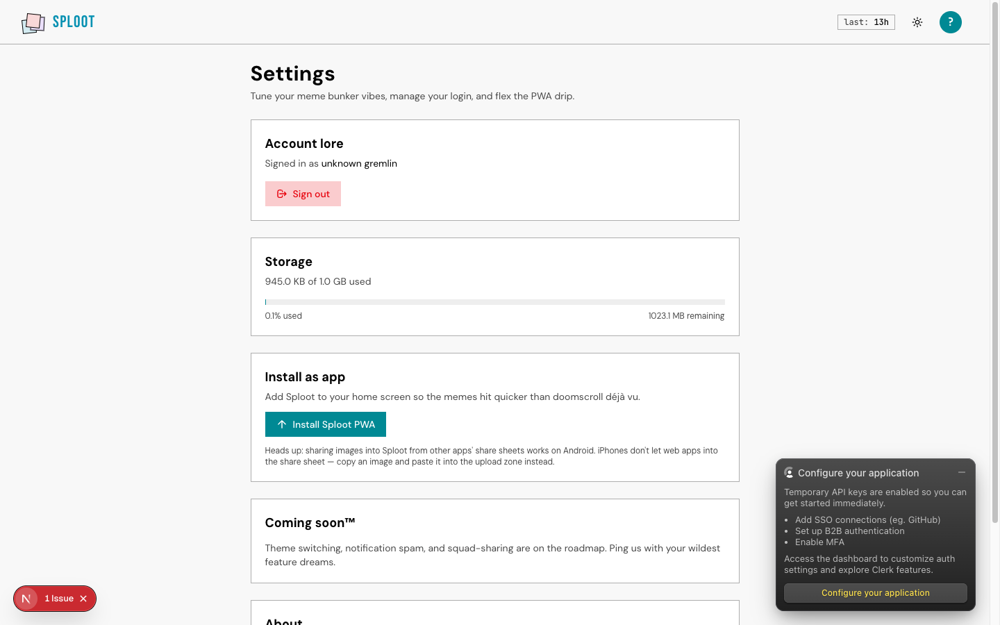
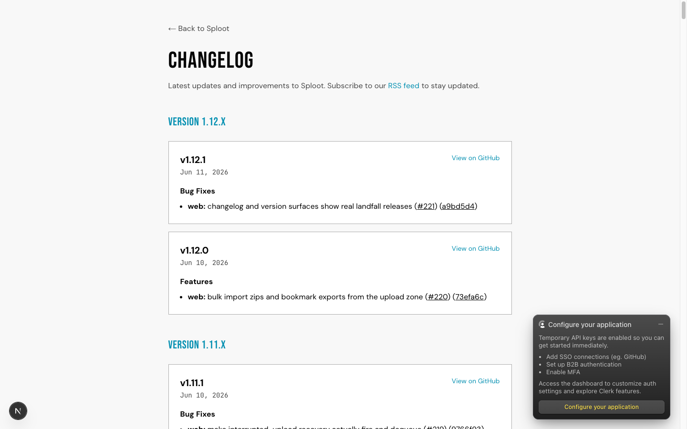
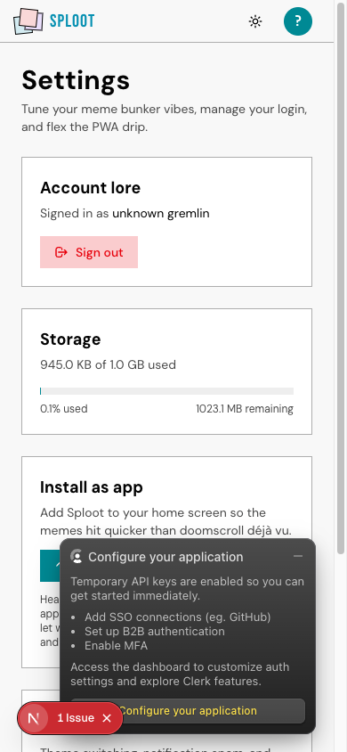
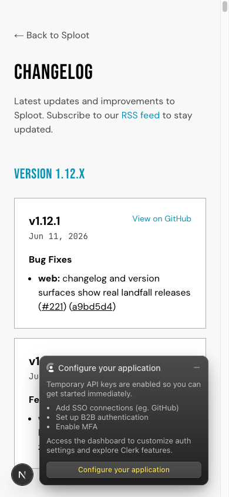

# Evidence Packet: ios-install-and-changelog

- Date: 2026-06-11
- Branch: `fix/ios-install-ux`
- Commit: `a9bd5d4`

## Intent

Settings never shows a dead disabled install button (button only when a real prompt exists; iOS gets share-menu instructions; honest Android-only share-sheet note), and /changelog renders semantic-release markdown correctly without card overflow.

## Checks

### PASS — tests: __tests__/lib/changelog-markdown.test.ts (1.9s)

```
CI=1 pnpm --filter web vitest run __tests__/lib/changelog-markdown.test.ts
```

Transcript: [transcripts/tests-0.txt](transcripts/tests-0.txt)

### PASS — tests: __tests__/hooks/is-ios-browser.test.ts (1.4s)

```
CI=1 pnpm --filter web vitest run __tests__/hooks/is-ios-browser.test.ts
```

Transcript: [transcripts/tests-1.txt](transcripts/tests-1.txt)

## Browser Evidence

### /app/settings @ 1440x900



Console errors:
- [error] A tree hydrated but some attributes of the server rendered HTML didn't match the client properties. This won't be patched up. This can happen if a SSR-ed Client Component used:

### /changelog @ 1440x900



No page or console errors.

### /app/settings @ 390x844



Console errors:
- [error] A tree hydrated but some attributes of the server rendered HTML didn't match the client properties. This won't be patched up. This can happen if a SSR-ed Client Component used:

### /changelog @ 390x844



No page or console errors.

## Verdict: PASS

⚠ 2 console error(s) captured — review the browser evidence before trusting this verdict.

## Residual Risk

- Real-iOS instruction branch verified by unit-tested UA detection + branch logic; desktop Chromium emulation still fires beforeinstallprompt so the button branch shows there (correct behavior for prompt-capable browsers). User confirms on device post-deploy.
- iOS share-sheet ingestion is platform-impossible for PWAs; ticket 033 (Shortcut + upload token) is the path.
