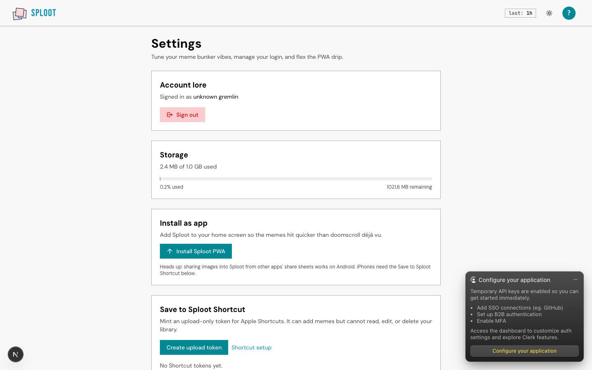
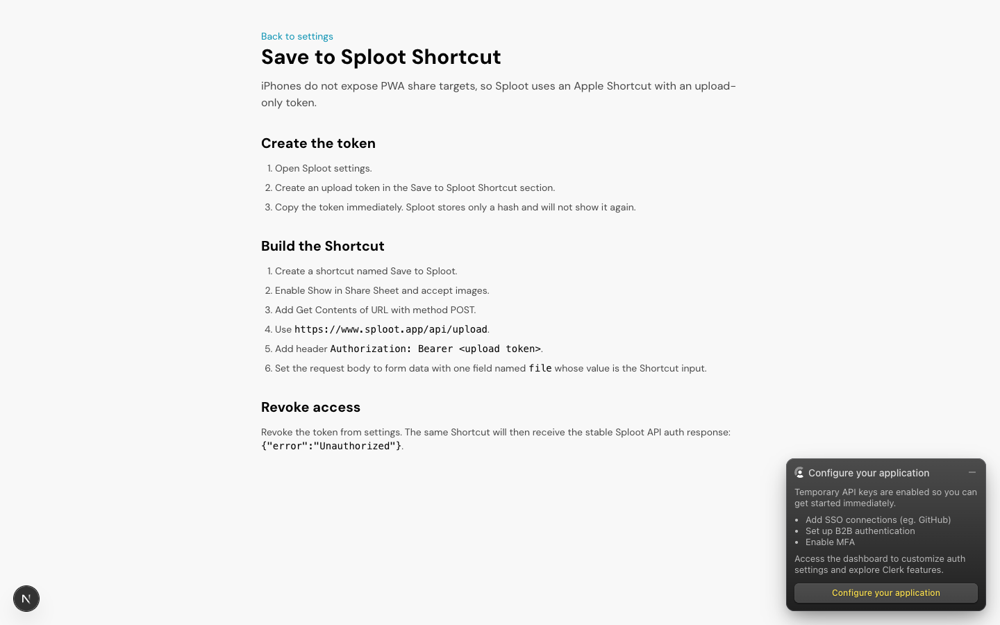
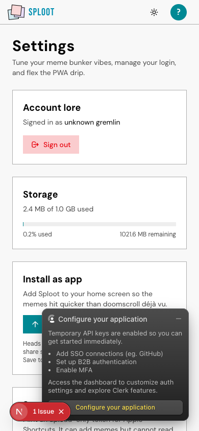
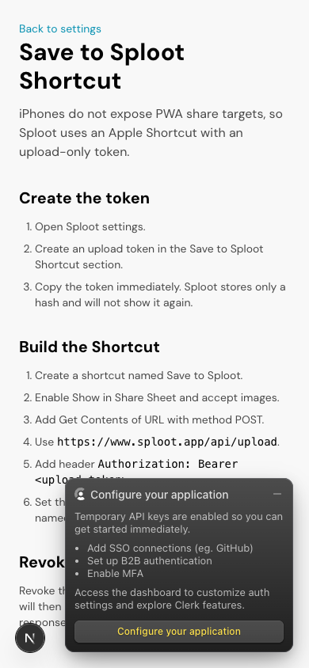

# Evidence Packet: ios-shortcut-upload-token

- Date: 2026-06-11
- Branch: `deliver-033-ios-shortcut-upload`
- Commit: `a468bae`

## Intent

iOS Shortcut token setup renders and token mint to upload to revoke to 401 cycle passes

## Checks

### PASS — qa seed (3.0s)

```
pnpm --filter web exec tsx scripts/qa-seed.ts --count 3
```

Transcript: [transcripts/qa-seed.txt](transcripts/qa-seed.txt)

### PASS — tests: __tests__/api/ios-shortcut-token-cycle.test.ts (1.7s)

```
CI=1 pnpm --filter web vitest run __tests__/api/ios-shortcut-token-cycle.test.ts
```

Transcript: [transcripts/tests-0.txt](transcripts/tests-0.txt)

### PASS — tests: __tests__/api/upload-tokens.test.ts (1.4s)

```
CI=1 pnpm --filter web vitest run __tests__/api/upload-tokens.test.ts
```

Transcript: [transcripts/tests-1.txt](transcripts/tests-1.txt)

### PASS — tests: __tests__/lib/auth/personal-upload-token.test.ts (1.8s)

```
CI=1 pnpm --filter web vitest run __tests__/lib/auth/personal-upload-token.test.ts
```

Transcript: [transcripts/tests-2.txt](transcripts/tests-2.txt)

## Browser Evidence

### /app/settings @ 1440x900



Console errors:
- [error] A tree hydrated but some attributes of the server rendered HTML didn't match the client properties. This won't be patched up. This can happen if a SSR-ed Client Component used:

### /docs/ios/save-to-sploot-shortcut @ 1440x900



No page or console errors.

### /app/settings @ 390x844



Console errors:
- [error] A tree hydrated but some attributes of the server rendered HTML didn't match the client properties. This won't be patched up. This can happen if a SSR-ed Client Component used:

### /docs/ios/save-to-sploot-shortcut @ 390x844



No page or console errors.

## Verdict: PASS

⚠ 2 console error(s) captured — review the browser evidence before trusting this verdict.

## Residual Risk

- Real iPhone share-sheet execution through Apple Shortcuts still requires a physical iOS device; this packet proves the server token/upload/revoke contract and rendered setup instructions.
