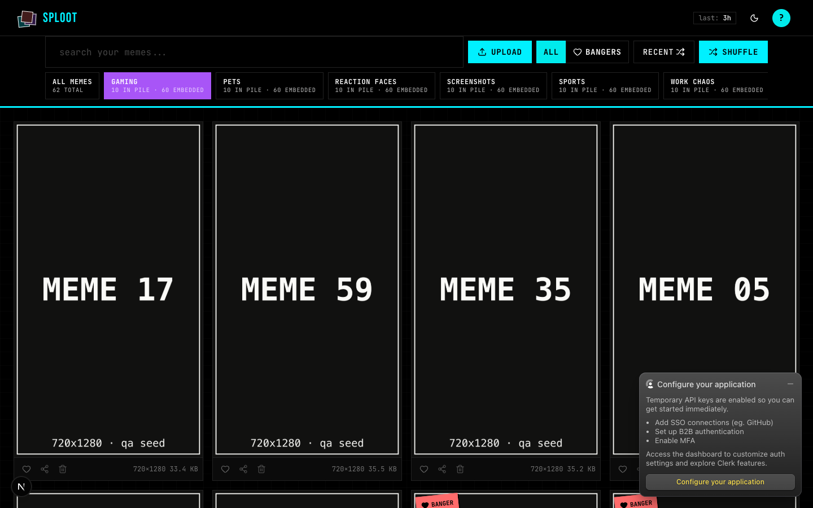
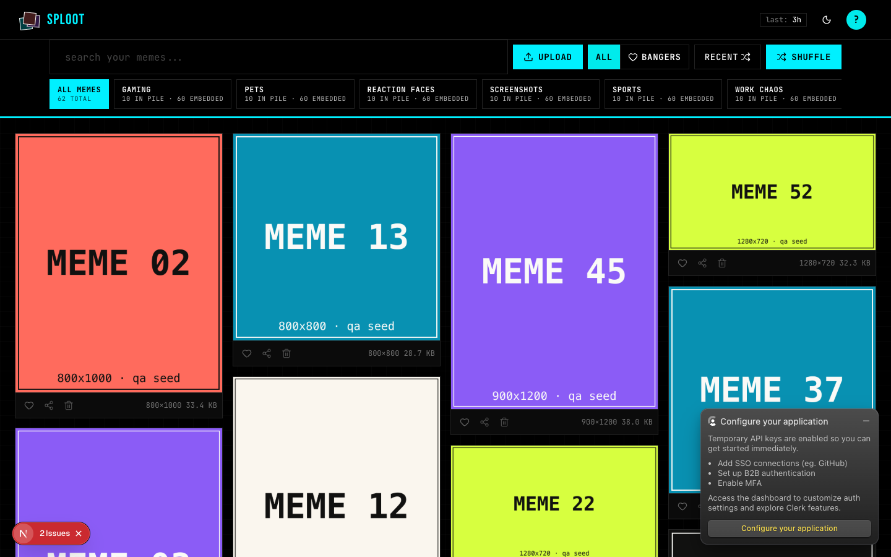
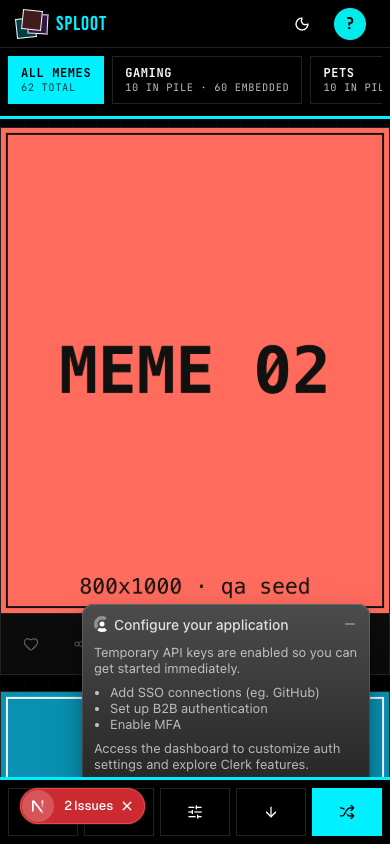

# Evidence Packet: library-pile-filter-rail

- Date: 2026-06-11
- Branch: `deliver-034-library-pile-filters`
- Commit: `70ff507`

## Intent

all memes stays the primary shuffled gallery while automatic piles act as compact filters

## Checks

### PASS — qa seed (4.0s)

```
pnpm --filter web exec tsx scripts/qa-seed.ts --count 60
```

Transcript: [transcripts/qa-seed.txt](transcripts/qa-seed.txt)

### PASS — tests: __tests__/components/sploot/pile-filter-rail.test.tsx (2.0s)

```
CI=1 pnpm --filter web vitest run __tests__/components/sploot/pile-filter-rail.test.tsx
```

Transcript: [transcripts/tests-0.txt](transcripts/tests-0.txt)

### PASS — tests: __tests__/lib/piles/semantic-piles.test.ts (1.4s)

```
CI=1 pnpm --filter web vitest run __tests__/lib/piles/semantic-piles.test.ts
```

Transcript: [transcripts/tests-1.txt](transcripts/tests-1.txt)

### PASS — tests: __tests__/api/piles.test.ts (1.5s)

```
CI=1 pnpm --filter web vitest run __tests__/api/piles.test.ts
```

Transcript: [transcripts/tests-2.txt](transcripts/tests-2.txt)

### PASS — api piles probe (2.2s)

```
GET /api/piles?limit=6&minAssets=50
```

Transcript: [transcripts/piles-probe.txt](transcripts/piles-probe.txt)

### PASS — browser pile filter exercise (12.1s)

```
agent-browser open /app, click [data-pile-filter-id], verify selected gallery state
```

Transcript: [transcripts/pile-filter-exercise.txt](transcripts/pile-filter-exercise.txt)

## Browser Evidence

### /app#pile-filter-probe @ 1440x900



Console errors:
- [error] A tree hydrated but some attributes of the server rendered HTML didn't match the client properties. This won't be patched up. This can happen if a SSR-ed Client Component used:
- [error] A tree hydrated but some attributes of the server rendered HTML didn't match the client properties. This won't be patched up. This can happen if a SSR-ed Client Component used:

### /app @ 1440x900



Console errors:
- [error] A tree hydrated but some attributes of the server rendered HTML didn't match the client properties. This won't be patched up. This can happen if a SSR-ed Client Component used:
- [error] A tree hydrated but some attributes of the server rendered HTML didn't match the client properties. This won't be patched up. This can happen if a SSR-ed Client Component used:

### /app @ 390x844



Console errors:
- [error] A tree hydrated but some attributes of the server rendered HTML didn't match the client properties. This won't be patched up. This can happen if a SSR-ed Client Component used:
- [error] A tree hydrated but some attributes of the server rendered HTML didn't match the client properties. This won't be patched up. This can happen if a SSR-ed Client Component used:

## Verdict: PASS

⚠ 6 console error(s) captured — review the browser evidence before trusting this verdict.

## Residual Risk

- QA seed still uses local generated fixtures rather than the user's real meme library
- Hydration mismatch console warnings are pre-existing on master; baseline docs/qa/evidence/2026-06-10-share-target/packet.md records the same /app warning
