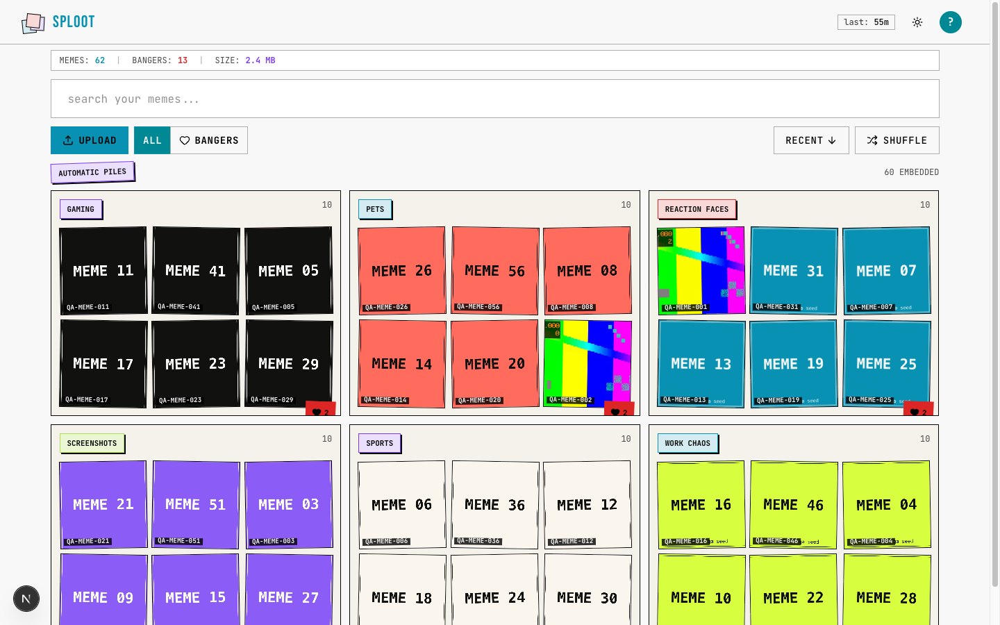
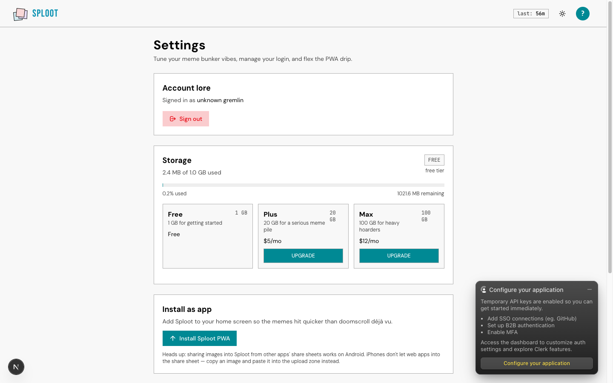
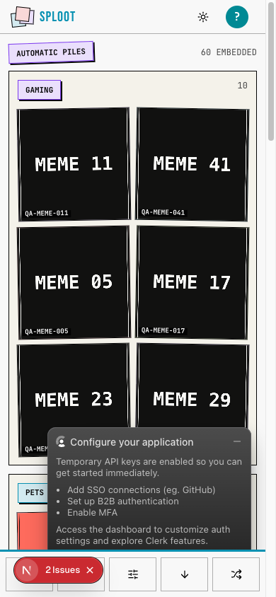
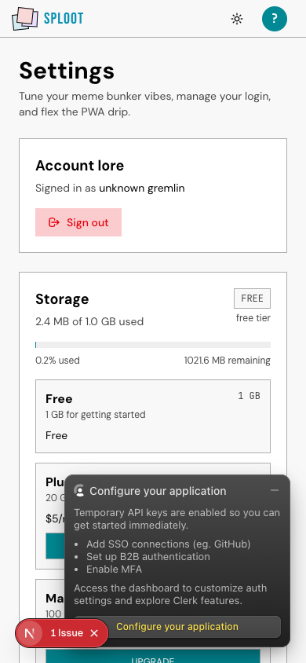

# Evidence Packet: storage-pricing

- Date: 2026-06-11
- Branch: `deliver-031-storage-pricing`
- Commit: `a468bae`

## Intent

storage pricing surfaces render and billing/quota contracts pass under plan-aware storage limits

## Checks

### PASS — qa seed (1.6s)

```
pnpm --filter web exec tsx scripts/qa-seed.ts --count 5
```

Transcript: [transcripts/qa-seed.txt](transcripts/qa-seed.txt)

### PASS — tests: __tests__/api/billing.test.ts (2.0s)

```
CI=1 pnpm --filter web vitest run __tests__/api/billing.test.ts
```

Transcript: [transcripts/tests-0.txt](transcripts/tests-0.txt)

### PASS — tests: __tests__/api/billing-webhook.test.ts (1.6s)

```
CI=1 pnpm --filter web vitest run __tests__/api/billing-webhook.test.ts
```

Transcript: [transcripts/tests-1.txt](transcripts/tests-1.txt)

### PASS — tests: __tests__/lib/billing/subscription-sync.test.ts (1.5s)

```
CI=1 pnpm --filter web vitest run __tests__/lib/billing/subscription-sync.test.ts
```

Transcript: [transcripts/tests-2.txt](transcripts/tests-2.txt)

### PASS — tests: __tests__/lib/quota/storage-quota-policy.test.ts (2.0s)

```
CI=1 pnpm --filter web vitest run __tests__/lib/quota/storage-quota-policy.test.ts
```

Transcript: [transcripts/tests-3.txt](transcripts/tests-3.txt)

## Browser Evidence

### / @ 1440x900



Console errors:
- [error] A tree hydrated but some attributes of the server rendered HTML didn't match the client properties. This won't be patched up. This can happen if a SSR-ed Client Component used:
- [error] A tree hydrated but some attributes of the server rendered HTML didn't match the client properties. This won't be patched up. This can happen if a SSR-ed Client Component used:

### /app/settings @ 1440x900



Console errors:
- [error] A tree hydrated but some attributes of the server rendered HTML didn't match the client properties. This won't be patched up. This can happen if a SSR-ed Client Component used:

### / @ 390x844



Console errors:
- [error] A tree hydrated but some attributes of the server rendered HTML didn't match the client properties. This won't be patched up. This can happen if a SSR-ed Client Component used:
- [error] A tree hydrated but some attributes of the server rendered HTML didn't match the client properties. This won't be patched up. This can happen if a SSR-ed Client Component used:

### /app/settings @ 390x844



Console errors:
- [error] A tree hydrated but some attributes of the server rendered HTML didn't match the client properties. This won't be patched up. This can happen if a SSR-ed Client Component used:

## Verdict: PASS

⚠ 6 console error(s) captured — review the browser evidence before trusting this verdict.

## Residual Risk

- Stripe test-mode Checkout was not exercised end to end because local STRIPE_SECRET_KEY, STRIPE_WEBHOOK_SECRET, STRIPE_PRICE_ID_PLUS, and STRIPE_PRICE_ID_MAX are unset; automated route tests cover typed env gates, duplicate-subscription rejection, and mocked Stripe checkout/webhook sync.
