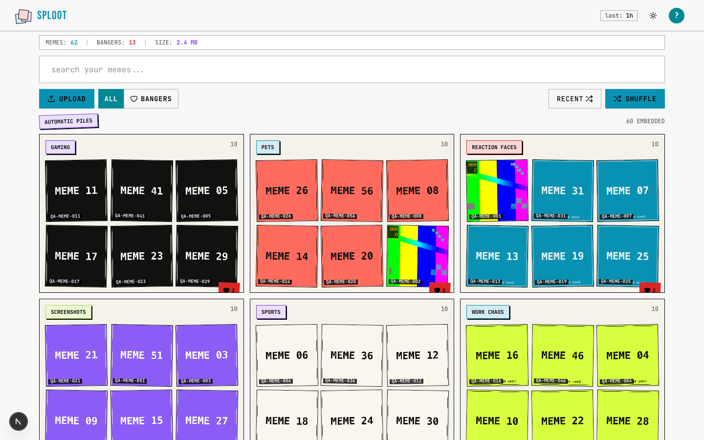
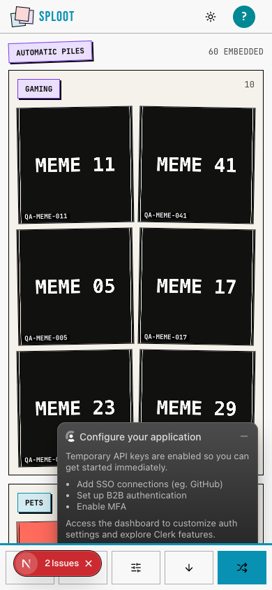

# Evidence Packet: taste-engine

- Date: 2026-06-11
- Branch: `deliver-029-taste-engine`
- Commit: `a468bae`

## Intent

taste mode ranks saved memes by banger centroid, keeps seeded shuffle as the default library order, and exposes a minimal taste profile

## Checks

### PASS — qa seed (7.8s)

```
pnpm --filter web exec tsx scripts/qa-seed.ts --count 60
```

Transcript: [transcripts/qa-seed.txt](transcripts/qa-seed.txt)

### PASS — tests: __tests__/hooks/use-sort-preferences.test.ts (3.0s)

```
CI=1 pnpm --filter web vitest run __tests__/hooks/use-sort-preferences.test.ts
```

Transcript: [transcripts/tests-0.txt](transcripts/tests-0.txt)

### PASS — tests: __tests__/lib/taste/taste-engine.test.ts (2.1s)

```
CI=1 pnpm --filter web vitest run __tests__/lib/taste/taste-engine.test.ts
```

Transcript: [transcripts/tests-1.txt](transcripts/tests-1.txt)

### PASS — tests: __tests__/api/assets.test.ts (2.2s)

```
CI=1 pnpm --filter web vitest run __tests__/api/assets.test.ts
```

Transcript: [transcripts/tests-2.txt](transcripts/tests-2.txt)

### PASS — tests: __tests__/api/taste-profile.test.ts (3.1s)

```
CI=1 pnpm --filter web vitest run __tests__/api/taste-profile.test.ts
```

Transcript: [transcripts/tests-3.txt](transcripts/tests-3.txt)

### PASS — tests: __tests__/api/assets.integration.test.ts (3.5s)

```
CI=1 pnpm --filter web vitest run __tests__/api/assets.integration.test.ts
```

Transcript: [transcripts/tests-4.txt](transcripts/tests-4.txt)

### PASS — api taste probe (6.1s)

```
GET /api/assets?sortBy=taste plus seeded shuffle and /api/taste/profile
```

Transcript: [transcripts/taste-probe.txt](transcripts/taste-probe.txt)

## Browser Evidence

### /app @ 1440x900



Console errors:
- [error] A tree hydrated but some attributes of the server rendered HTML didn't match the client properties. This won't be patched up. This can happen if a SSR-ed Client Component used:
- [error] A tree hydrated but some attributes of the server rendered HTML didn't match the client properties. This won't be patched up. This can happen if a SSR-ed Client Component used:

### /app @ 390x844



Console errors:
- [error] A tree hydrated but some attributes of the server rendered HTML didn't match the client properties. This won't be patched up. This can happen if a SSR-ed Client Component used:
- [error] A tree hydrated but some attributes of the server rendered HTML didn't match the client properties. This won't be patched up. This can happen if a SSR-ed Client Component used:

## Verdict: PASS

⚠ 4 console error(s) captured — review the browser evidence before trusting this verdict.

## Residual Risk

- taste-matched generation intentionally not implemented; see ADR 0004
