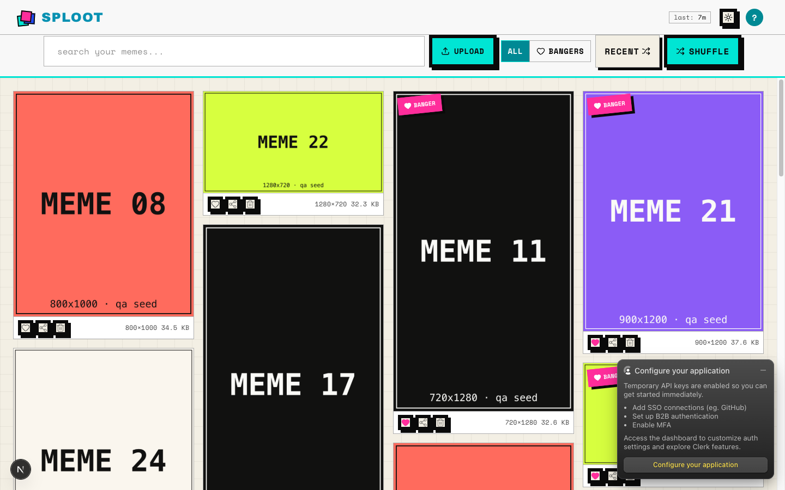
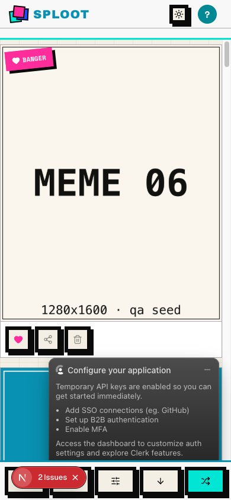

# Evidence Packet: backlog-038-share-file

- Date: 2026-07-02
- Branch: `backlog/038-share-actual-meme-file`
- Commit: `03afa25`

## Intent

backlog 038 verifies library share surface after file share and desktop image clipboard wiring

## Checks

### PASS — qa seed (1.8s)

```
pnpm --filter web qa:seed
```

Transcript: [transcripts/qa-seed.txt](transcripts/qa-seed.txt)

### PASS — type-check (1.4s)

```
pnpm --filter web type-check
```

Transcript: [transcripts/type-check.txt](transcripts/type-check.txt)

### PASS — lint (2.1s)

```
pnpm --filter web lint
```

Transcript: [transcripts/lint.txt](transcripts/lint.txt)

## Browser Evidence

### /app @ 1440x900



Console errors:
- [error] A tree hydrated but some attributes of the server rendered HTML didn't match the client properties. This won't be patched up. This can happen if a SSR-ed Client Component used:
- [error] A tree hydrated but some attributes of the server rendered HTML didn't match the client properties. This won't be patched up. This can happen if a SSR-ed Client Component used:

### /app @ 390x844



Console errors:
- [error] A tree hydrated but some attributes of the server rendered HTML didn't match the client properties. This won't be patched up. This can happen if a SSR-ed Client Component used:
- [error] A tree hydrated but some attributes of the server rendered HTML didn't match the client properties. This won't be patched up. This can happen if a SSR-ed Client Component used:

## Verdict: PASS

⚠ 4 console error(s) captured — review the browser evidence before trusting this verdict.

## Residual Risk

- None recorded.
