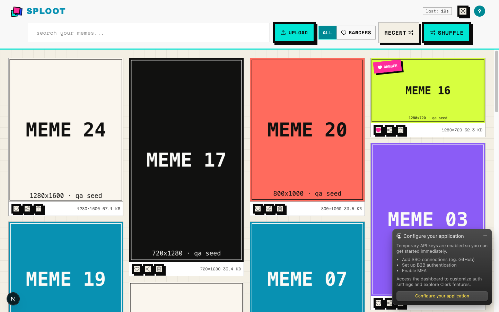
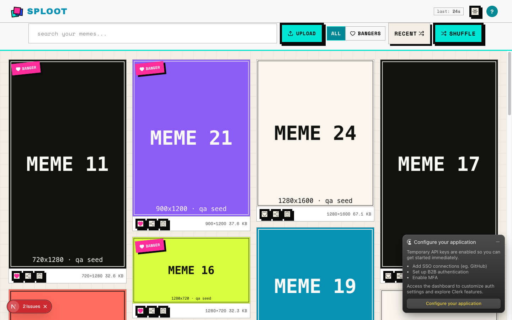
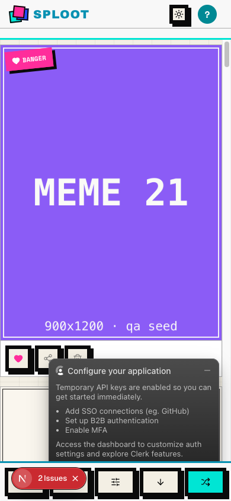
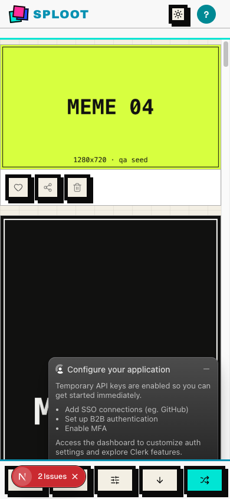

# Evidence Packet: backlog-039-search

- Date: 2026-07-02
- Branch: `backlog/039-search-debounce-zero-results`
- Commit: `7f29f51`

## Intent

backlog 039 verifies debounced search surface and honest no-results empty state

## Checks

### PASS — qa seed (2.7s)

```
pnpm --filter web qa:seed
```

Transcript: [transcripts/qa-seed.txt](transcripts/qa-seed.txt)

### PASS — type-check (1.6s)

```
pnpm --filter web type-check
```

Transcript: [transcripts/type-check.txt](transcripts/type-check.txt)

### PASS — lint (2.6s)

```
pnpm --filter web lint
```

Transcript: [transcripts/lint.txt](transcripts/lint.txt)

## Browser Evidence

### /app @ 1440x900



Console errors:
- [error] A tree hydrated but some attributes of the server rendered HTML didn't match the client properties. This won't be patched up. This can happen if a SSR-ed Client Component used:
- [error] A tree hydrated but some attributes of the server rendered HTML didn't match the client properties. This won't be patched up. This can happen if a SSR-ed Client Component used:

### /app/search @ 1440x900



Console errors:
- [error] A tree hydrated but some attributes of the server rendered HTML didn't match the client properties. This won't be patched up. This can happen if a SSR-ed Client Component used:
- [error] A tree hydrated but some attributes of the server rendered HTML didn't match the client properties. This won't be patched up. This can happen if a SSR-ed Client Component used:

### /app @ 390x844



Console errors:
- [error] A tree hydrated but some attributes of the server rendered HTML didn't match the client properties. This won't be patched up. This can happen if a SSR-ed Client Component used:
- [error] A tree hydrated but some attributes of the server rendered HTML didn't match the client properties. This won't be patched up. This can happen if a SSR-ed Client Component used:

### /app/search @ 390x844



Console errors:
- [error] A tree hydrated but some attributes of the server rendered HTML didn't match the client properties. This won't be patched up. This can happen if a SSR-ed Client Component used:
- [error] A tree hydrated but some attributes of the server rendered HTML didn't match the client properties. This won't be patched up. This can happen if a SSR-ed Client Component used:

## Verdict: PASS

⚠ 8 console error(s) captured — review the browser evidence before trusting this verdict.

## Residual Risk

- None recorded.
