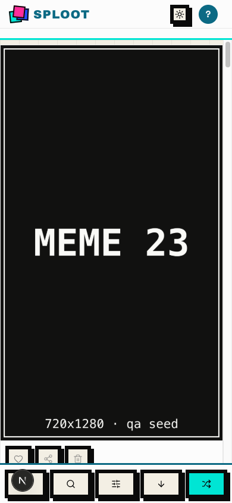

# Evidence Packet: sploot-076-fix-regression

- Date: 2026-07-07
- Branch: `master`
- Commit: `d421ba9`

## Intent

sploot-076: qa:evidence --base-url against dev:local reads the persisted qa-auth secret automatically (no manual export) and produces an authed walk

## Checks

### PASS — qa seed (4.9s)

```
pnpm --filter web qa:seed
```

Transcript: [transcripts/qa-seed.txt](transcripts/qa-seed.txt)

## Browser Evidence

### /app @ 1440x900


No page or console errors.

### /app @ 390x844



No page or console errors.

## Verdict: PASS

## Residual Risk

- None recorded.
