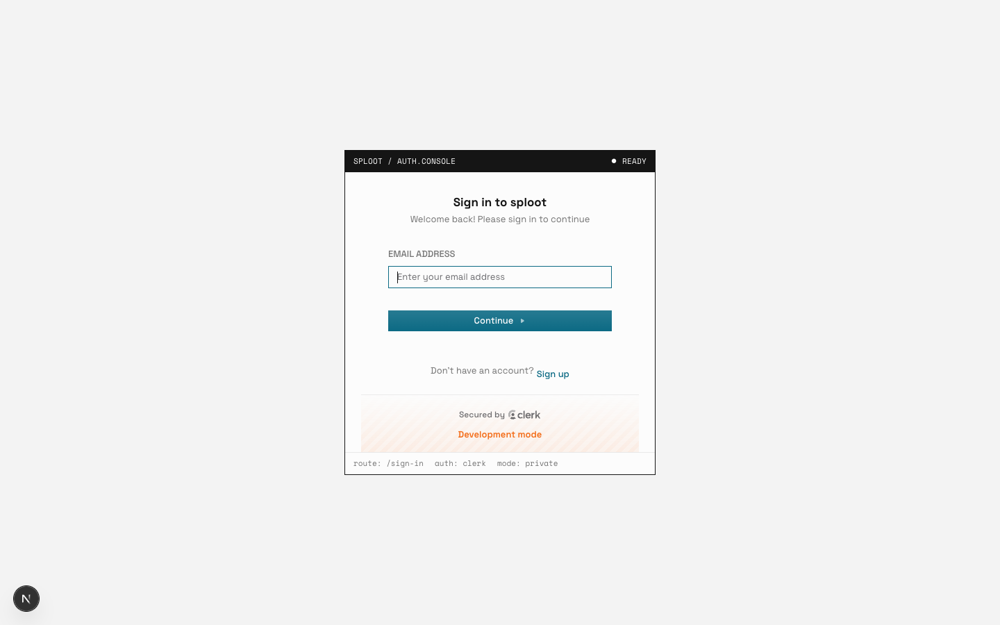
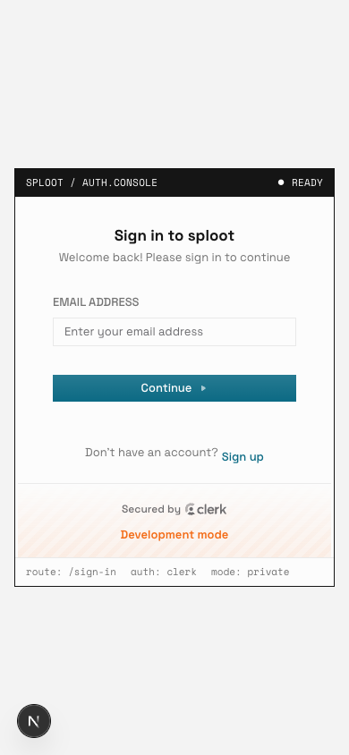

# Evidence Packet: sploot-076-signin-wall-regression

- Date: 2026-07-07
- Branch: `master`
- Commit: `d421ba9`

## Intent

sploot-076: prove a mismatched qa-auth secret lands on the sign-in wall and the packet FAILS loudly instead of the prior false PASS

## Checks

## Browser Evidence

### /app @ 1440x900

🛑 Landed on the sign-in wall instead of the requested route — no authenticated evidence was captured.

No page or console errors.

### /app @ 390x844

🛑 Landed on the sign-in wall instead of the requested route — no authenticated evidence was captured.

No page or console errors.

## Verdict: FAIL

## Residual Risk

- None recorded.
