# Evidence Packet: sploot-032-feedback-complete

- Date: 2026-07-09
- Branch: `feat/sploot-032-feedback`
- Base commit before implementation: `7348ac3`

## Intent

prove seeded workbench, search confidence rail, restrained settings, editorial detail, full-media rendering, and responsive navbar clearance

## Checks

### PASS — qa seed (3.0s)

```
pnpm --filter web qa:seed
```

Transcript: [transcripts/qa-seed.txt](transcripts/qa-seed.txt)

### PASS — CI-parity ship gate

```sh
pnpm lint && pnpm type-check && pnpm lint:design && pnpm --filter web test && pnpm --filter extension build
```

- Lint: 0 errors (28 pre-existing warnings)
- Type-check: 4/4 workspaces passed
- Design ratchet: passed
- Web: 107 files, 1085 tests passed
- Extension: Chrome MV3 build passed

## Browser Evidence

### /app @ 1440x900

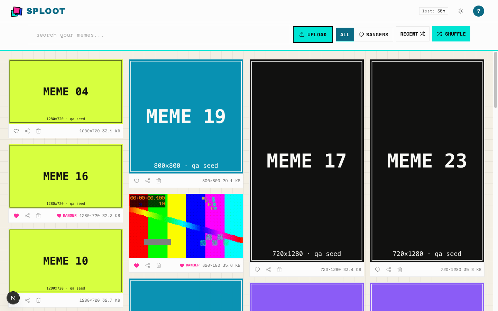

No page or console errors.

### /app/search?q=reaction%20face @ 1440x900


No page or console errors.

### /app/settings @ 1440x900

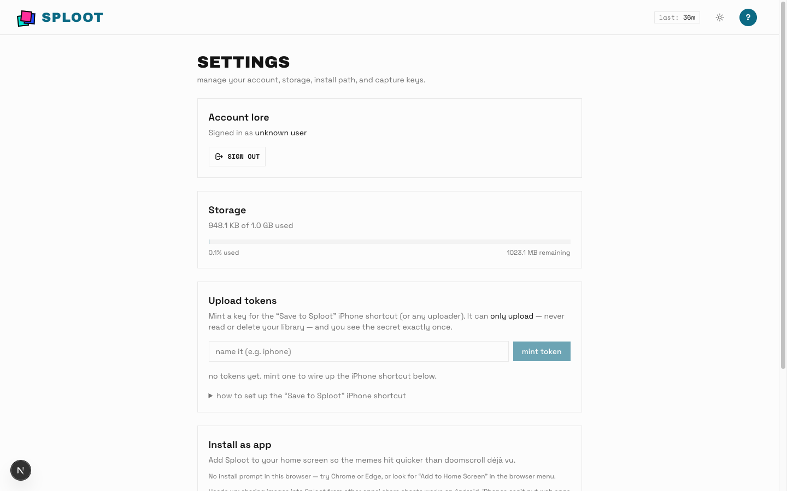

No page or console errors.

### /app/meme/cmrdw8yr4001b5qoefgcfm5tg @ 1440x900

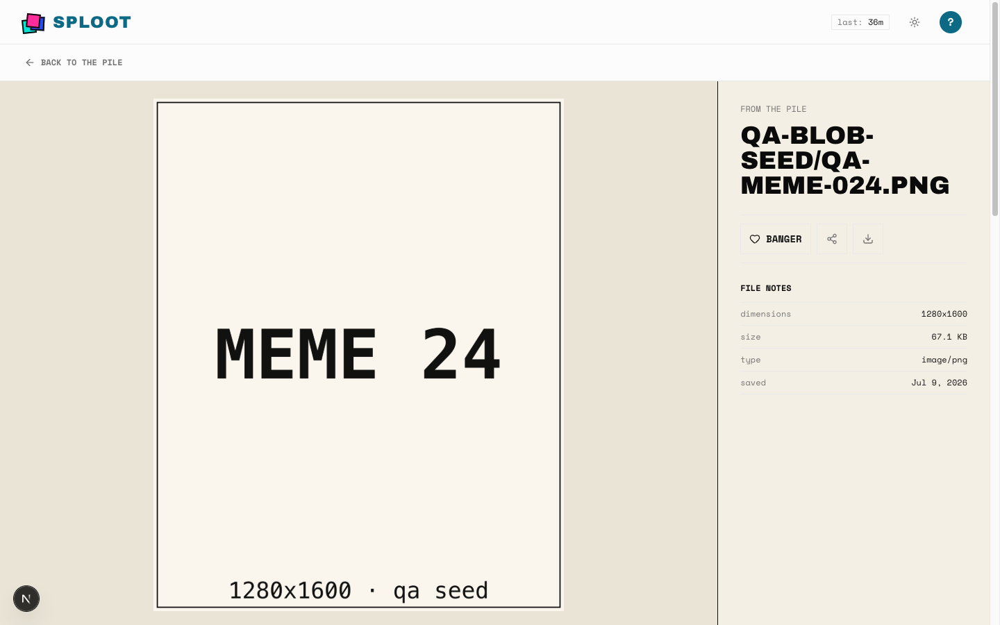

No page or console errors.

### /app @ 390x844


No page or console errors.

### /app/search?q=reaction%20face @ 390x844

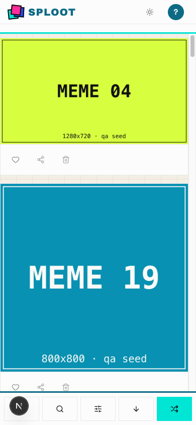

No page or console errors.

### /app/settings @ 390x844

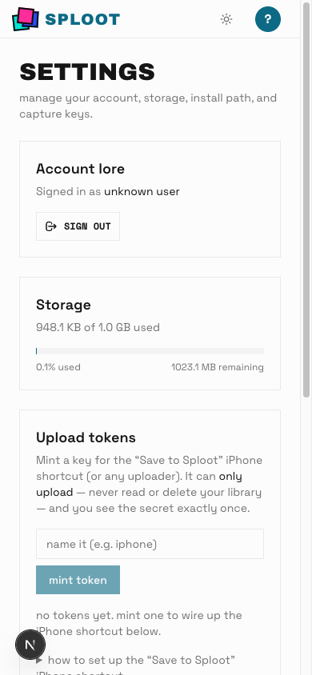

No page or console errors.

### /app/meme/cmrdw8yr4001b5qoefgcfm5tg @ 390x844

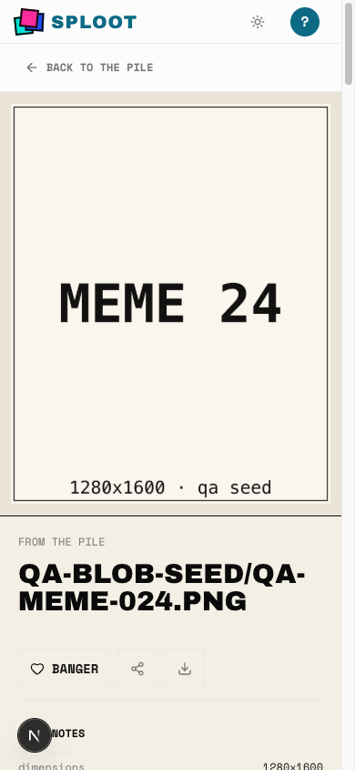

No page or console errors.

### Search-confidence rail @ 1440x900

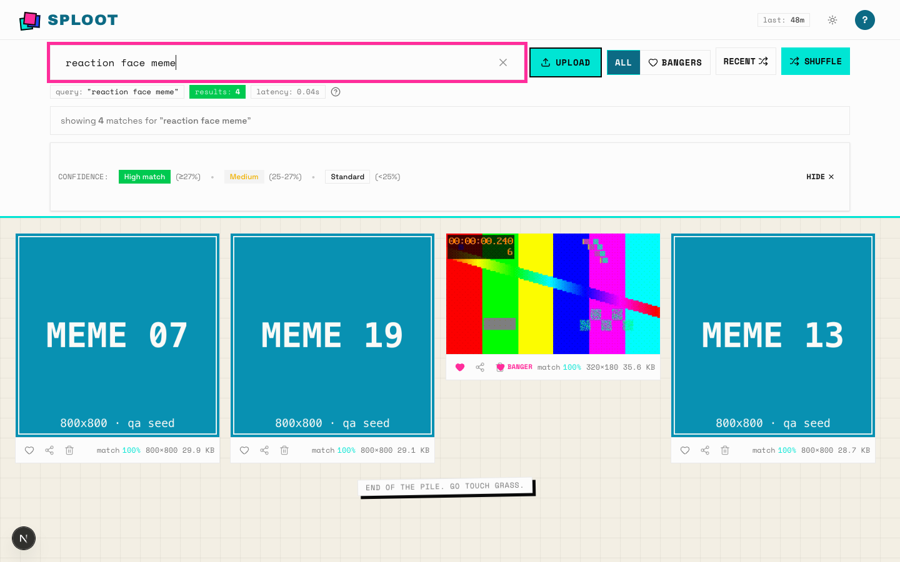

The signed-in browser submitted `reaction face meme`; `/api/search` returned
four results. Match percentages and banger status render in the metadata rail
below each complete image/video frame.

### Public landing @ 1440x900

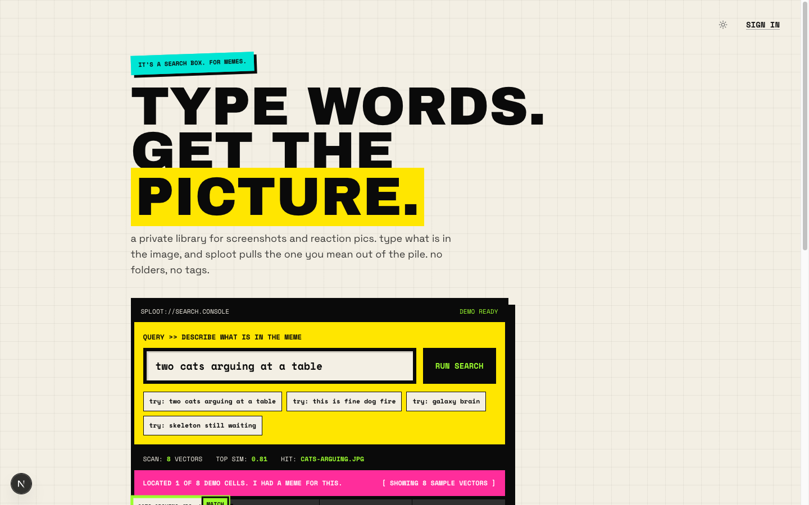

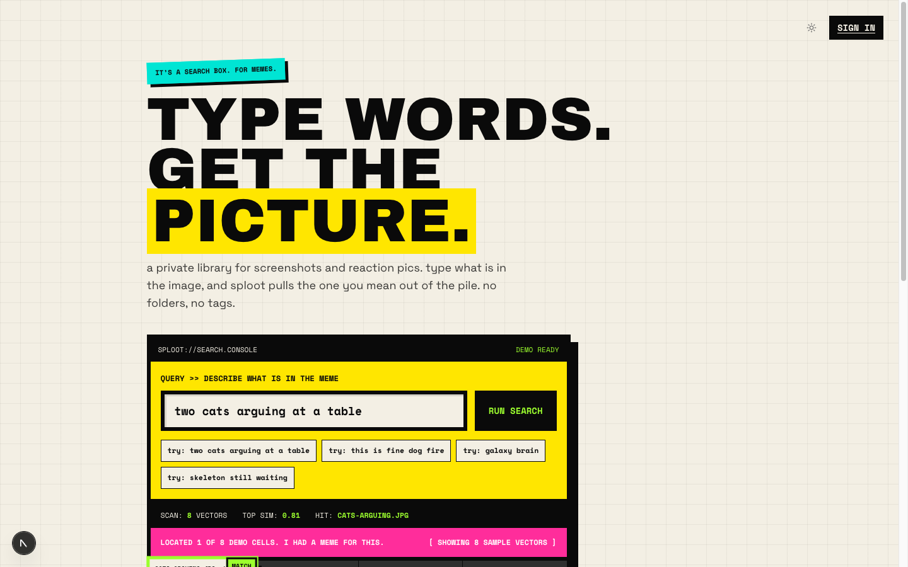

An isolated unauthenticated session proved the console hero, raster demo pile,
flat theme control, and readable sign-in hover without page errors.

### Converged lab directions @ 1440x900

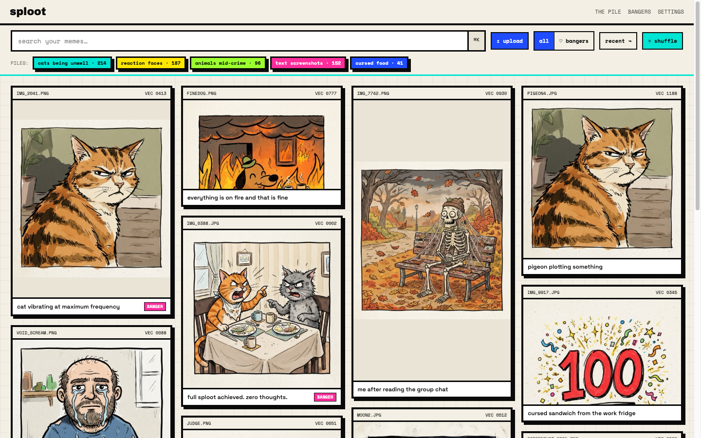

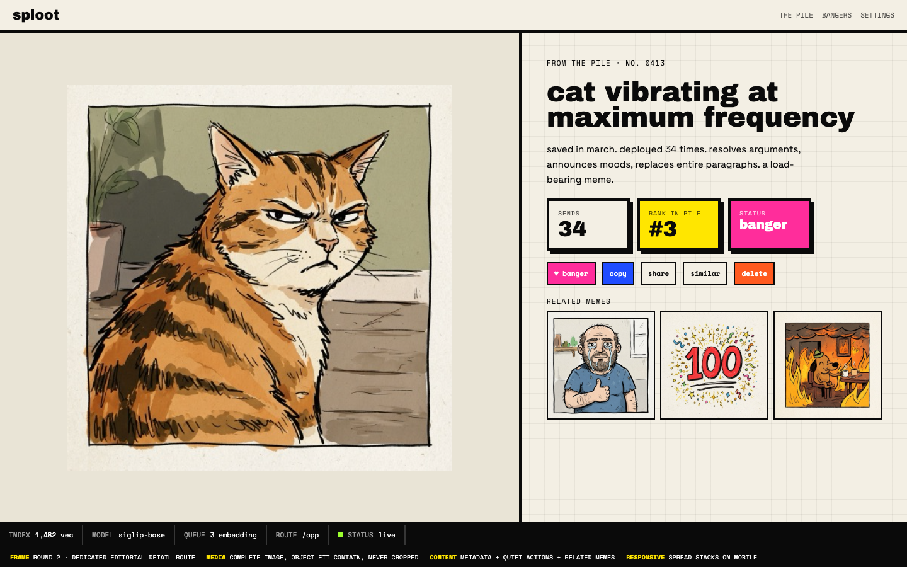

GRID-1 is the faithful command-bar/masonry workbench and DET-10 is the editorial
detail winner. Both use repo-owned raster meme assets with `object-fit: contain`;
the round-two registry retains neo-brutalist zine as base and sticker-bomb as the
only challenger.

## Verdict: PASS

## Residual Risk

- Local QA uses deterministic seeded assets/embeddings. Live Replicate,
  production Blob, and deployed Vercel behavior were not exercised.
- Legacy non-square video posters are intentionally omitted so the uncropped
  first frame renders; aspect-safe `-preview-v2` posters remain enabled.
