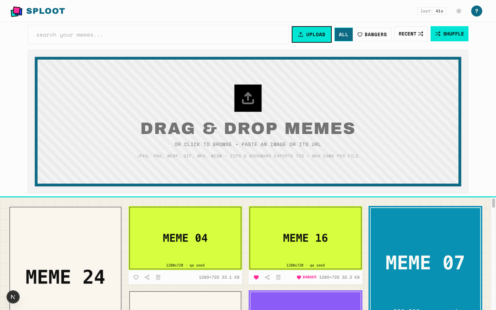
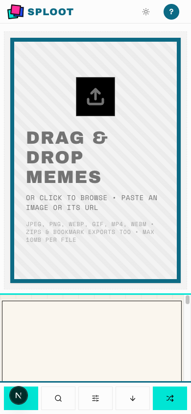
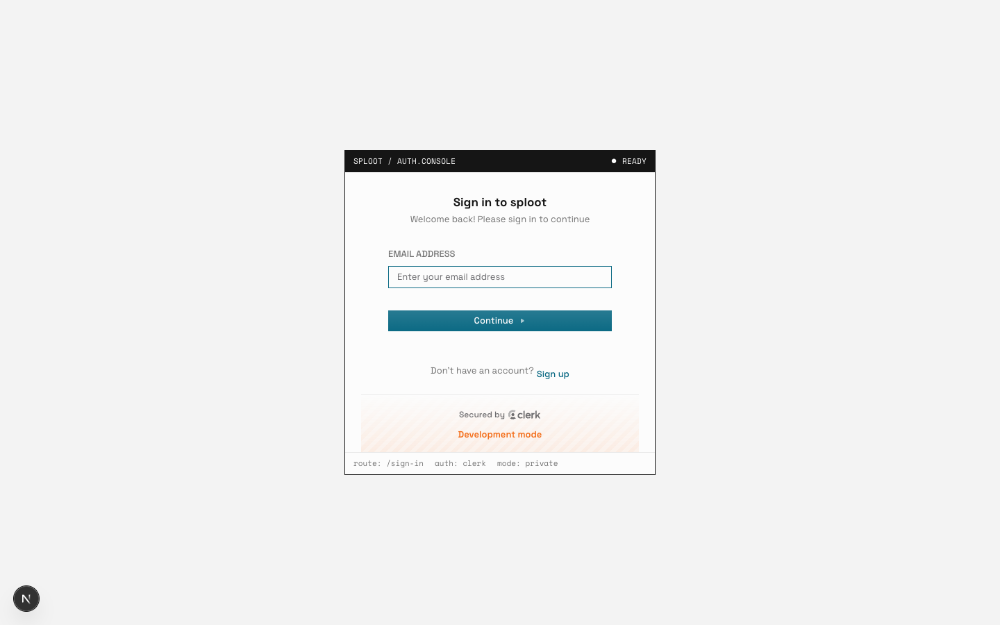
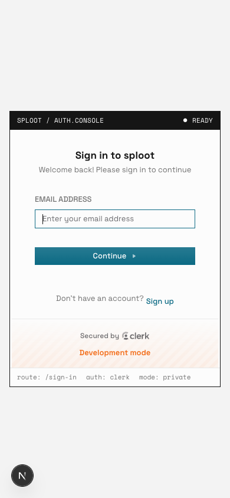

# Evidence Packet: sploot-032-upload-proof

- Date: 2026-07-09
- Branch: `feat/sploot-032-feedback`
- Commit: `adcd61a`

## Intent

prove drop-zone upload intake and the centered auth door at desktop and mobile widths

## Checks

### PASS — qa seed (1.9s)

```
pnpm --filter web qa:seed
```

Transcript: [transcripts/qa-seed.txt](transcripts/qa-seed.txt)

## Browser Evidence

### /app/upload @ 1440x900



No page or console errors.

### /app/upload @ 390x844



No page or console errors.

### /sign-in @ 1440x900



No page errors. The centered auth console stays compact and readable.

### /sign-in @ 390x844



No page errors or horizontal overflow.

## Verdict: PASS

## Residual Risk

- Clerk rendered with local development keys; no credential submission was attempted.
