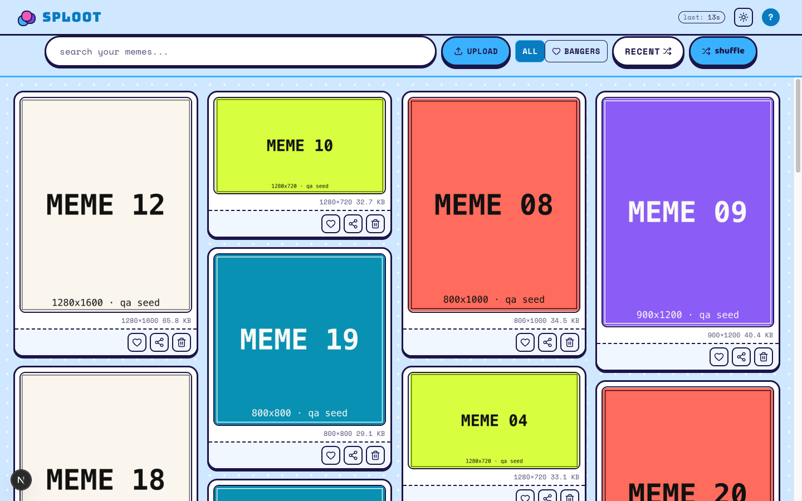
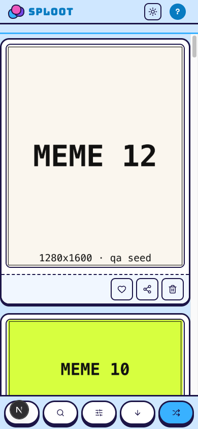

# Evidence Packet: review-live-crit

- Date: 2026-07-10
- Branch: `feat/toybox-design-system`
- Commit: `8bccf30`

## Intent

adversarial live review

## Checks

### PASS — qa seed (2.2s)

```
pnpm --filter web qa:seed
```

Transcript: [transcripts/qa-seed.txt](transcripts/qa-seed.txt)

## Browser Evidence

### /app @ 1440x900



No page or console errors.

### /app @ 390x844



No page or console errors.

## Verdict: PASS

## Residual Risk

- None recorded.
